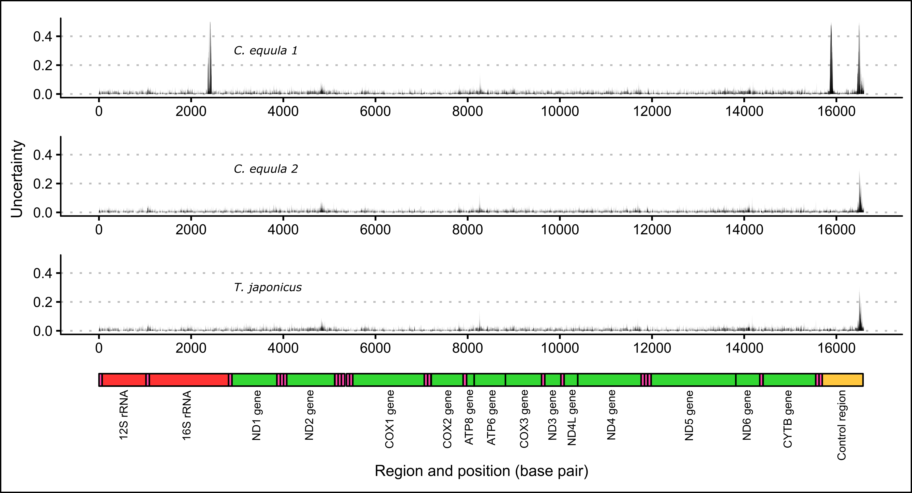
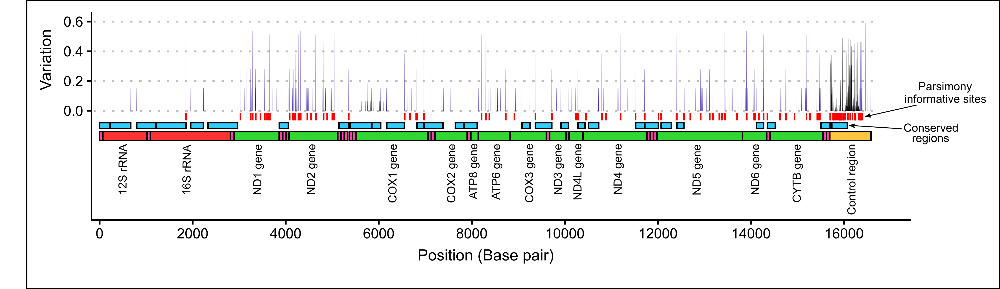

# Chapter two: Assembly and description of the *P. georgianus* mitogenome {#mitogenome}

## Introduction

The general structure of the mitochondrial genome is typically well conserved among ray-finned and cartilaginous fish and gene rearrangements are uncommon [@Satoh2016]. These mitogenomes are typically composed of thirteen protein coding genes, twenty-two tRNA's, two rRNA's, one noncoding control region [@Avise1987] and intergenic regions of variable sizes, similar to other vertebrates [@Satoh2016]. The start and stop codons for protein coding genes are variable, although there are common gene-specific codons among ray-finned and cartilaginous fish [@Satoh2016]. The most variable structure of fish mitogenomes is the gene length [@Satoh2016].

Complete mitogenome sequence data has traditionally been obtained using direct Sanger sequencing and/or mitochondrial DNA re-sequencing (MitoChip) [@Ye2014]. With the advent of high-throughput DNA sequencing (e.g. Illumina systems), mitogenome sequences can be obtained by sequencing mitochondrial DNA enriched from nuclear DNA or indirectly through mircoarray hybridization and long-range PCR-based sequencing [@Hahn2013; @Ye2014]. Mitogenome sequences can also be produced indirectly by isolating the mitochondrial sequences from whole genome sequence data in silico. This is done by mapping sequence reads to a reference mitogenome [@Ye2014]. For example, this technique has been used to produce the blue cod (*Parapercis colias*) mitogenome [@Smith2012].

Complete annotated mitogenomes can be used to design species-specific PCR primers which reduces the occurrence of failed or non-specific primer binding which can be an issue with cross-species designed primers. Annotated sequence data can also be used to verify that primers are successfully amplifying the target region. If there are several mitogenomes available for a species of interest or a group of closely related species, conserved and variable regions can be more easily identified. This has the wider implication of reducing the cost and time spent establishing and optimising PCR protocols and therefore improving the success of population genetic studies.

The mitogenomes of several fish species from a wide range of families have been reported and scores of unpublished mitogenomes are also regularly being uploaded to NCBI GenBank producing an extensive genetic database. A quick search for mitogenomes of ray-finned fish in GenBank returns 12,647 results. Yet for many New Zealand fish species, such as the *Pseudocaranx* genus, there is currently little or no complete mitogenome sequence data available. Constructing the mitogenome of *P. georgianus* is an important first step in the broader aim to study the taxonomy, population structure and demographic history of *P. georgianus* and the wider genus.

## Materials and methods

### *P. georgianus* mitogenome assembly {#popStructurePart1}

In this chapter, the *Pseudocaranx georgianus* mitogenome is isolated and assembled from whole genome sequence data in Geneious version 11.1.5 [@Kearse2012]. Quality checked whole-genome sequence data for thirteen broodstock *P. georgianus* was provided by Plant and Food Research (PFR) in Nelson, New Zealand (referred to as *Broodstock trevally 1* to *Broodstock trevally 13* in this chapter). This data was produced by the Australian Genome Research Facility Ltd. (AGRF) using whole genome Illumina paired-end sequencing on three HiSeq lanes. Between 27 to 36 million reads 125 base pairs in length were produced for each individual. No information was provided on the average depth of coverage of the genomes. The annotated genome is described and compared to a closely related species and the typical features of the mitogenomes of ray-finned and cartilaginous fish. The effect that several methodological choices had on the quality of the contig alignments and consensus *P. georgianus* mitogenomes are also explored.

BLAST searches and a literature search were used to establish species that are closely related to *P. georgianus* for which complete annotated mitogenome is available. The COI gene of a *P. georgianus* individual sampled from Victoria, Australia (GenBank accession: [EF609442](https://www.ncbi.nlm.nih.gov/nuccore/EF609442)) was blasted against a nucleotide collection database using a discontiguous megablast that handles more dissimilar sequences like inter-species variation [@Biomatters2018]. This BLAST search queried the National Center for Biotechnology Information (NCBI) within Geneious version 11.1.5 [@Kearse2012] and returned a list of genetically similar sequences and their ranked pairwise identity scores.

A reference mitogenome that was returned with a high pairwise identity score to *P. georgianus* at the COI gene (*Carangoides equula*, GenBank accession: [KM201334](https://www.ncbi.nlm.nih.gov/nuccore/KM201334)) was used to assemble a preliminary *P. georgianus* mitogenome. From this *P. georgianus* mitogenome, species specific primers were designed to target the COI gene of *P. georgianus* in Primer3 version 2.3.7 [@Untergasser2012] within Geneious version 11.1.5 [@Kearse2012]. These primers were used to PCR amplify and sequence the COI gene of a few initial New Zealand *P. georgianus* samples caught off the coast of Raglan on the west coast of New Zealand's North Island. One of these initial COI sequences was used in a secondary discontiguous megaBLAST search to identify reference mitogenomes that were closely related to *P. georgianus* from New Zealand waters. 

Whole genome sequence data of all thirteen *P. georgianus* individuals were imported into Geneious version 11.1.5 [@Kearse2012] using FASTQ sequence import. During import, the paired reads were set using the appropriate parameters (read technology: Illumina, pair type: paired end - inward pointing, insert size: 125). For all mitogenome assemblies, the whole genome sequence reads were mapped to a reference mitogenome using Geneious mapper, with medium-low sensitivity and no trimming before mapping. From the resulting contig scaffolds, the consensus sequences were annotated by transferring the annotations of the reference genome to the *P. georgianus* consensus mitogenome sequence.

To investigate the effect that the mitogenome assembly methods had on the quality of the mitogenome assemblies and the consensus mitogenomes, the whole genome data of all thirteen individuals was assembled to three closely related reference mitogenomes identified in BLAST and literature searches (*C. equula 1*, *C. equula 2* and *T. japonicus*). Whole genome data of three individuals (*Broodstock trevally 1*, *Broodstock trevally 2* and *Broodstock trevally 3*) was also mapped to one reference genome (*C. equula 2*) using 2, 3, 5, 10, 25, 1000, 10000 and 100000 iterations. Lastly, any differences among individuals mapped to the same reference genome (*C. equula 2*) with the same number of mapping iterations (1000) was compared. The structure and quality of the contig scaffolds and consensus mitogenomes were compared by identifying any differences in their general structure, annotation length or placement, unresolved regions, percentage identities, contig depth and number of identical sites. Uncertainty was calculated by subtracting the pairwise identity at each nucleotide position from one. All pairwise alignments of consensus mitogenomes were created using the Mauve genome alignment plugin (version 1.1.1) [@Darling2010] implemented in Geneious version 11.1.5 [@Kearse2012]

### *P. georgianus* mitogenome description

A final *P. georgianus* mitogenome was produced using the best methods identified in section \@ref(popStructurePart1); one *P. georgianus* was mapped to *C. equula 2* (1000 mapping iterations). The *P. georgianus* mitogenome was then described and compared to the mitogenomes of other ray-finned and cartilaginous fish described by @Satoh2016, as well as to the closely related species *Carangoides equula* (Whitefin Trevally, GenBank accession: [NC_025644](https://www.ncbi.nlm.nih.gov/nuccore/NC_025644)) (a different individual from that used to assemble the *P. georgianus* mitogenome). The general features of the whole mitogenome structure as well as the protein coding genes, non-coding regions, tRNA's, rRNA's and intergenic regions were identified. The location of the stop and start codons for each gene were identified using typical start and stop codons present in other fish described by @Satoh2016. The level of within-species variation, conserved regions and parsimony informative sites were found using a consensus of mitogenome sequences from all thirteen Broodstock trevally individuals (mapped to *C. equula 2* with 1000 mapping iterations). The first half of the control region was mapped to sequence data from 304 *P. georgianus* individuals sampled from New Zealand (see Section \@ref(popStructurePart1)). Within-species variation was quantified by aligning the data and subtracting the percentage identity at each nucleotide position from 1. Conserved regions and parsimony informative sites were identified in DnaSP version 6.12.3 [@Rozas2017]. The final presentation of the *P. georgianus* mitogenome was created using the R Shiny application created by @Yu2018.

## Results

### *P. georgianus* mitogenome assembly {#mtGenomeAssembly}

The mitogenome of a *Carangoides equula* (Whitefin Trevally) individual sampled from Victoria, Australia (GenBank accession: [KX373635](https://www.ncbi.nlm.nih.gov/nuccore/KX373635), herein referred to as *C. equula 1*) was returned as the mitogenome with the highest pairwise identity to the COI gene (92.1%) of *P. georgianus* in the first BLAST search. This species was also found to be closely related to the *Pseudocaranx* genus in a phylogenetic study of the Carangidae family [@Damerau2018].

A second BLAST search returned a mitogenome of another *C. equula* individual (GenBank accession: [KM201334](https://www.ncbi.nlm.nih.gov/nuccore/KM201334), herein referred to as *C. equula 2*) with a high pairwise identity to the reference (92.4%). The mitogenome with the second highest pairwise identity was a *Trachurus japonicus* individual (GenBank accession: [AP003092](https://www.ncbi.nlm.nih.gov/nuccore/AP003092), herein referred to as *T. japonicus*) with a pairwise identity of 89.7%.

#### Comparison of reference genomes {-}

When whole genome sequence data of the same *P. georgianus* individual (*Broodstock trevally 1*) was assembled to three different reference mitogenomes, most nucleotide positions had a percentage identity to the reference between 0.9 and 1.0 (see Figure \@ref(fig:percentageIdentityDiffRefs)). When *C. equula 2* and *T. japonicus* were used as reference genomes, the percentage identities ranged between 0.59 and 1.0. However, when *C. equula 1* was used as a reference genome, some nucleotide positions had a low percentage identity to the reference (percentage identity ranged between 0.25 and 1.0). These nucleotide positions with low percentage identities to the reference arose primarily from four poorly resolved regions along the mitogenome. These included one region in 16S rRNA region, one region in the ATP8 gene and two regions in the D-loop (see Figure \@ref(fig:unresolvedRegions)). All four of these regions were uncertain when *C. equula 1* was used as a reference genome. When assembled to the *C. equula 2* and *T. japonicus* reference genomes, the unresolved regions in the 16S rRNA region and the first region in the control region were resolved, although the ATP8 region and the second D-loop region remained uncertain (see Figure \@ref(fig:unresolvedRegions)). The number of nucleotide positions that are identical to the reference genome (identical sites) was lowest when *C. equula 1* was used as a reference genome and highest when *C. equula 2* was used as a reference (see Figure \@ref(fig:iterationsIdenticalSites)).

The overall placement of the annotations on the consensus mitogenomes were congruent among individuals mapped to the same reference genome. However, there was some variation in the placement of annotations by up to thirteen base pairs (See Figure \@ref(fig:annotationConflictExample)). Of the three reference genomes, the whole genome sequences assembled equally well to *C. equula 2* and *T. japonicus*. *C. equula 1* performed the poorest as a reference mitogenome, despite being considered taxonomically more closely related to the *Pseudocaranx* genus than *T. japonicus*.

```{r eval = FALSE}
contigDataLongKX <- read.csv("data/05-mitogenome/contigDataLongKX.csv") %>% 
  filter(iterations == "1,000") %>% 
  filter(genome == "1tbs")
contigDataLongKM <- read.csv("data/05-mitogenome/contigDataLongKM.csv") %>% 
  filter(iterations == "1,000") %>% 
  filter(genome == "1tbs")
contigDataLongAP <- read.csv("data/05-mitogenome/contigDataLongAP.csv") %>% 
  filter(iterations == "1,000") %>% 
  filter(genome == "1tbs")

percentIdentity <- bind_rows(contigDataLongKX, contigDataLongKM, contigDataLongAP) %>%
  ggplot(aes(x = reference, y = identity)) + 
  geom_jitter(height = 0.05, width = 0.25, alpha = 0.5, size = 0.1) +
  theme_clean(base_size = 13) +
  scale_x_discrete(limits = c("KX373635", "KM201334", "AP003092"), labels = expression(italic("C. equula 1"), italic("C. equula 2"), italic("T. japonicus"))) +
  labs(x = "Reference mitogenome", y = "Identity to reference") +
  scale_y_continuous(limits = c(0, 1), breaks = scales::pretty_breaks(n = 4))

  ggsave(filename = "images/05-mitogenome/percentageIdentityDiffRefs.svg", width = 9, height = 3.5, device = "svg", units = "in")
```

```{r percentageIdentityDiffRefs, out.width = "100%", fig.align = "center", fig.cap = "Identities of each nucleotide position of whole genome sequence data of one $\\textit{P. georgianus}$ individual ($\\textit{Broodstock trevally 1}$) mapped to three reference mitogenomes."}
library(knitr)

```

```{r, eval = FALSE}
KX <- read.csv("data/05-mitogenome/contigDataLongKX.csv") %>%
  filter(iterations == "1,000") %>%
  filter(genome == "1tbs") %>%
  mutate(variability = (1-identity))
KM <- read.csv("data/05-mitogenome/contigDataLongKM.csv") %>%
  filter(iterations == "1,000") %>%
  filter(genome == "1tbs") %>%
  mutate(variability = (1-identity))
AP <- read.csv("data/05-mitogenome/contigDataLongAP.csv") %>%
  filter(iterations == "1,000") %>%
  filter(genome == "1tbs") %>%
  mutate(variability = (1-identity))

# To plot
anns <- read.csv("data/05-mitogenome/annotations.csv") %>%  
  filter(type == "gene" | type == "tRNA" | type == "rRNA" | type == "D-loop") 

# To label
labels <- read.csv("data/05-mitogenome/annotations.csv") %>%  
  filter(type == "gene" | type == "rRNA" | type == "D-loop") %>% 
  mutate(middle = min + max) %>%
  mutate(middle = middle/2)

genes <- anns %>%
  filter(type == "gene")

trna <- anns %>%
  filter(type == "tRNA")

rrna <- anns %>%
  filter(type == "rRNA")

dloop <- anns %>%
  filter(type == "D-loop")

uncertaintyKX <- ggplot() +
  theme_clean(base_size = 13) +
  geom_area(data = KX, aes(x = position, y = variability), fill = "black") +
  labs(x = element_blank(), y = "Uncertainty") +
  scale_x_continuous(limits = c(0, 16600), breaks = scales::pretty_breaks(n = 10)) +
  scale_y_continuous(limits = c(0, 0.5), breaks = scales::pretty_breaks(n = 3)) 

uncertaintyKM <- ggplot() +
  theme_clean(base_size = 13) +
  geom_area(data = KM, aes(x = position, y = variability), fill = "black") +
  labs(x = element_blank(), y = "Uncertainty") +
  scale_x_continuous(limits = c(0, 16600), breaks = scales::pretty_breaks(n = 10)) +
  scale_y_continuous(limits = c(0, 0.5), breaks = scales::pretty_breaks(n = 3)) 

uncertaintyAP <- ggplot() +
  theme_clean(base_size = 13) +  
  geom_area(data = AP, aes(x = position, y = variability), fill = "black") +
  geom_rect(data = genes, aes(xmin = min, ymin = -0.005, xmax = max, ymax = -0.03), fill = "green3", color = "black", alpha = 0.8) +
  geom_rect(data = trna, aes(xmin = min, ymin = -0.005, xmax = max, ymax = -0.03), fill = "deeppink", color = "black", alpha = 0.8) +
  geom_rect(data = rrna, aes(xmin = min, ymin = -0.005, xmax = max, ymax = -0.03), fill = "red", color = "black", alpha = 0.8) +
  geom_rect(data = dloop, aes(xmin = min, ymin = -0.005, xmax = max, ymax = -0.03), fill = "darkgoldenrod1", color = "black", alpha = 0.8) +
  geom_text(data = labels, mapping = aes(x = labels$middle, y = -0.04, label = annotation), hjust = "right", size = 2, angle = 90, check_overlap = TRUE) +
  labs(x = element_blank(), y = "Uncertainty") +
  scale_x_continuous(limits = c(0, 16600), breaks = scales::pretty_breaks(n = 10)) +
  scale_y_continuous(limits = c(-0, 0.5), breaks = scales::pretty_breaks(n = 3)) 

mtgenome <- ggplot() +
  theme_clean(base_size = 13) +
  geom_rect(data = genes, aes(xmin = min, ymin = 0.4, xmax = max, ymax = 0.5), fill = "green3", color = "black", alpha = 0.8) +
  geom_rect(data = trna, aes(xmin = min, ymin = 0.4, xmax = max, ymax = 0.5), fill = "deeppink", color = "black", alpha = 0.8) +
  geom_rect(data = rrna, aes(xmin = min, ymin = 0.4, xmax = max, ymax = 0.5), fill = "red", color = "black", alpha = 0.8) +
  geom_rect(data = dloop, aes(xmin = min, ymin = 0.4, xmax = max, ymax = 0.5), fill = "darkgoldenrod1", color = "black", alpha = 0.8) +
  geom_text(data = labels, mapping = aes(x = labels$middle, y = 0.38, label = annotation), hjust = "right", size = 2, angle = 90, check_overlap = TRUE) +
  labs(x = "Region and position (base pair)", y = "Uncertainty") +
  scale_x_continuous(limits = c(0, 16600), breaks = scales::pretty_breaks(n = 10)) +
  scale_y_continuous(limits = c(-0, 0.5), breaks = scales::pretty_breaks(n = 1)) 

arrangeGrob(uncertaintyKX, uncertaintyKM, uncertaintyAP, mtgenome, nrow = 4, ncol = 1) %>%
  ggsave(filename = "images/05-mitogenome/unresolvedRegions.svg", width = 9, height = 5, device = "svg", units = "in")
```

```{r unresolvedRegions, out.width = "100%", fig.align = "center", fig.cap = "Uncertainty in the consensus mitogenome resulting from assembling whole genome data of one *P. georgianus* individual (*Broodstock trevally 1*) to three reference mitogenomes."}

```

```{r, eval = FALSE}
image <- read.csv("data/05-mitogenome/summaryDiffIterationsContigs.csv", header = TRUE) %>%
  ggplot(aes(x = iterations, 
             y = identicalSites, 
             group = interaction(genome, reference),
             color = genome,
             shape = reference)) + 
  geom_line() +
  geom_point(size = 2) +
  theme_clean(base_size = 13) +
  labs(x = "Number of iterations", y = "Proportion of identical sites") +
  scale_x_discrete(limits = c("2", "3", "5", "10", "25", "100", "1,000", "10,000", "100,000"), 
                   labels = expression("2", "3", "5", "10", "25", "10"^2, "10"^3, "10"^4, "10"^5)) +
  scale_y_continuous(limits = c(0.3, 0.7), breaks = scales::pretty_breaks(n = 5)) +
  scale_shape_discrete(name = "Reference genome",
                       breaks = c("KX373635", "KM201334", "AP003092"),
                       labels = c("C. equula1", "C. equula2", "T. japonicus")) +
  scale_color_discrete(name = "Individual",
                       breaks = c("1tbs", "2tbs", "3tbs"),
                       labels = c("*P. georgianus* 1", "*P. georgianus* 2", "*P. georgianus* 3"))
                       
ggsave(file = "images/05-mitogenome/iterationsIdenticalSites.svg", width = 9, height = 3, device = "svg", units = "in")
```

```{r iterationsIdenticalSites, out.width = "100%", fig.align = "center", fig.cap = "Proportion of identical sites of the mitogenome assemblies of three *P. georgianus* individuals to three reference genomes related to the number of mapping iterations."}

```

```{r annotationConflictExample, out.width = "100%", fig.align = "center", fig.cap = "An example of the annotation conflicts among consensus mitogenomes associated with using three different reference mitogenomes."}

```

#### Number of mapping iterations {-}

Increasing the number of mapping iterations used in the mitogenome assemblies reduced the frequency of regions with no coverage, low contig depth and nucleotide positions with a low percentage identity to the reference genome (see Figure \@ref(fig:coverageDiffIterations)). However, a saturation point appears to be reached where increasing the number of mapping iterations provided no further improvement to lower range contig depths, percentage identities values (see Figure \@ref(fig:coverageDiffIterations)) or some unresolved regions (see Figure \@ref(fig:identityDiffIterations)). This saturation point occurred at a different number of mapping iterations depending on which reference mitogenome was used for the assembly. The highest number of mapping iterations were required to reach this saturation point when the data was assembled to the *C. equula 1* reference genome (around ten mapping iterations). The saturation point for the contig depth was reached after only three mapping iterations to the *C. equula 2* reference genome, and a saturation for percentage identities was reached after five mapping iterations. For the *T. japonicus* reference genome, the saturation point was reached after 5 mapping iterations. Once these saturation points were reached, comparatively low contig depth and percentage identities values remained when mapped to the *C. equula 1* reference genome.  

There were six regions of uncertainty along the length of the mitogenome (represented as peaks in uncertainty in Figure \@ref(fig:identityDiffIterations)) including two regions in the ND2 gene, one region in the ATP6 gene, one region in the ND6 gene and two regions in the control region. Some of these uncertain regions were resolved by increasing the number of mapping iterations (see Figure \@ref(fig:identityDiffIterations)), however three of the six regions (one region in the ND2 gene, one region in the ATP6 gene and one region in the control region) were not fully resolved by increasing the number of mapping iterations. 

Surprisingly, the number of nucleotide positions that were identical to the reference mitogenome (identical sites) tended to decrease as the number of mapping iterations increased until around five to ten mapping iterations. At this point, usually no additional reads were mapped to the contig scaffold (see Figure \@ref(fig:iterationsIdenticalSites)). This may be due the presence of nucleotide discrepancies within contigs (see Figure \@ref(fig:contigScaffold)) or mitochondrial heteroplasmy being included in the contig scaffold in higher frequency as more contigs are assembled to the reference genome.

```{r, eval = FALSE}
coverageKX <- read.csv("data/05-mitogenome/contigDataLongKX.csv") %>%
  filter(genome == "1tbs") %>%
  ggplot(aes(x = iterations, y = coverage)) +
  geom_violin(colour = "black", fill = "deepskyblue3", alpha = 0.2) +
  theme_clean(base_size = 13) +
  scale_x_discrete(limits = c("2", "3", "5", "10", "25", "100", "1,000", "10,000", "100,000"), 
                   labels = expression("2", "3", "5", "10", "25", "10"^2, "10"^3, "10"^4, "10"^5)) +
  labs(x = element_blank(), y = "Contig depth") +
  ylim(0, 200)

identityKX <- read.csv("data/05-mitogenome/contigDataLongKX.csv") %>%
  filter(genome == "1tbs") %>%
  ggplot(aes(x = iterations, y = identity)) +
  geom_jitter(height = 0.05, width = 0.25, alpha = 0.5, size = 0.05) +
  theme_clean(base_size = 13) +
  scale_x_discrete(limits = c("2", "3", "5", "10", "25", "100", "1,000", "10,000", "100,000"), 
                   labels = expression("2", "3", "5", "10", "25", "10"^2, "10"^3, "10"^4, "10"^5)) +
  labs(x = "Number of iterations", y = "Identity to reference") +
  scale_y_continuous(limits = c(0, 1), breaks = scales::pretty_breaks(n = 4))

coverageKM <- read.csv("data/05-mitogenome/contigDataLongKM.csv") %>%
  filter(genome == "1tbs") %>%
  ggplot(aes(x = iterations, y = coverage)) +
  geom_violin(colour = "black", fill = "deepskyblue3", alpha = 0.2) +
  theme_clean(base_size = 13) +
  scale_x_discrete(limits = c("2", "3", "5", "10", "25", "100", "1,000", "10,000", "100,000"), 
                   labels = expression("2", "3", "5", "10", "25", "10"^2, "10"^3, "10"^4, "10"^5)) +
  labs(x = element_blank(), y = element_blank()) +
  ylim(0, 200)

identityKM <- read.csv("data/05-mitogenome/contigDataLongKM.csv") %>%
  filter(genome == "1tbs") %>%
  ggplot(aes(x = iterations, y = identity)) +
  geom_jitter(height = 0.05, width = 0.25, alpha = 0.5, size = 0.05) +
  theme_clean(base_size = 13) +
  scale_x_discrete(limits = c("2", "3", "5", "10", "25", "100", "1,000", "10,000", "100,000"), 
                   labels = expression("2", "3", "5", "10", "25", "10"^2, "10"^3, "10"^4, "10"^5)) +
  labs(x = "Number of iterations", y = element_blank()) +
  scale_y_continuous(limits = c(0, 1), breaks = scales::pretty_breaks(n = 4))

coverageAP <- read.csv("data/05-mitogenome/contigDataLongAP.csv") %>%
  filter(genome == "1tbs") %>%
  ggplot(aes(x = iterations, y = coverage)) +
  geom_violin(colour = "black", fill = "deepskyblue3", alpha = 0.2) +
  theme_clean(base_size = 13) +
  scale_x_discrete(limits = c("2", "3", "5", "10", "25", "100", "1,000", "10,000", "100,000"), 
                   labels = expression("2", "3", "5", "10", "25", "10"^2, "10"^3, "10"^4, "10"^5)) +
  labs(x = element_blank(), y = element_blank()) +
  ylim(0, 200)

identityAP <- read.csv("data/05-mitogenome/contigDataLongAP.csv") %>%
  filter(genome == "1tbs") %>%
  ggplot(aes(x = iterations, y = identity)) +
  geom_jitter(height = 0.05, width = 0.25, alpha = 0.5, size = 0.05) +
  theme_clean(base_size = 13) +
  scale_x_discrete(limits = c("2", "3", "5", "10", "25", "100", "1,000", "10,000", "100,000"), 
                   labels = expression("2", "3", "5", "10", "25", "10"^2, "10"^3, "10"^4, "10"^5)) +
  labs(x = "Number of iterations", y = element_blank())
  scale_y_continuous(limits = c(0, 1), breaks = scales::pretty_breaks(n = 4))

arrangeGrob(coverageKX, coverageKM, coverageAP, identityKX, identityKM, identityAP, nrow = 2, ncol = 3) %>%
  ggsave(file = "images/05-mitogenome/coverageDiffIterations.svg", width = 9, height = 5, device = "svg", units = "in")
```

```{r coverageDiffIterations, out.width = "100%", fig.align = "center", fig.cap = "The contig depths and percentage identities of whole genome data of one individual (*Broodstock trevally 1*) mapped to the *C. equula 2* reference mitogenome using different numbers of mapping iterations."}

```

```{r, eval = FALSE}
a <- read.csv("data/05-mitogenome/contigDataLongKM.csv") %>%
  filter(genome == "1tbs")

iterations2 <- a %>%
  filter(iterations == "2") %>%
  mutate(variability = (1-identity))
iterations2$position <- as.integer(iterations2$position)  

iterations3 <- a %>%
  filter(iterations == "3") %>%
  mutate(variability = (1-identity))
iterations3$position <- as.integer(iterations3$position)

iterations5 <- a %>%
  filter(iterations == "5") %>%
  mutate(variability = (1-identity))
iterations5$position <- as.integer(iterations5$position)

iterations10 <- a %>%
  filter(iterations == "10") %>%
  mutate(variability = (1-identity))
iterations10$position <- as.integer(iterations10$position)

iterations100000 <- a %>%
  filter(iterations == "10,000") %>%
  mutate(variability = (1-identity))
iterations100000$position <- as.integer(iterations100000$position)

# To plot
anns <- read.csv("data/05-mitogenome/annotations.csv") %>%  
  filter(type == "gene" | type == "tRNA" | type == "rRNA" | type == "D-loop") 

# To label
labels <- read.csv("data/05-mitogenome/annotations.csv") %>%  
  filter(type == "gene" | type == "rRNA" | type == "D-loop") %>% 
  mutate(middle = min + max) %>%
  mutate(middle = middle/2)

genes <- anns %>%
  filter(type == "gene")

trna <- anns %>%
  filter(type == "tRNA")

rrna <- anns %>%
  filter(type == "rRNA")

dloop <- anns %>%
  filter(type == "D-loop")

uncertainty2iterations <- ggplot() +
  theme_clean(base_size = 13) +
  geom_area(data = iterations2, aes(x = position, y = variability), fill = "black") +
  labs(x = element_blank(), y = "Uncertainty") +
  scale_x_continuous(limits = c(0, 16600), breaks = scales::pretty_breaks(n = 10)) +
  scale_y_continuous(limits = c(0, 0.5), breaks = scales::pretty_breaks(n = 3)) 

uncertainty3iterations <- ggplot() +
  theme_clean(base_size = 13) +
  geom_area(data = iterations3, aes(x = position, y = variability), fill = "black") +
  labs(x = element_blank(), y = "Uncertainty") +
  scale_x_continuous(limits = c(0, 16600), breaks = scales::pretty_breaks(n = 10)) +
  scale_y_continuous(limits = c(0, 0.5), breaks = scales::pretty_breaks(n = 3))

uncertainty5iterations <- ggplot() +
  theme_clean(base_size = 13) +
  geom_area(data = iterations5, aes(x = position, y = variability), fill = "black") +
  labs(x = element_blank(), y = "Uncertainty") +
  scale_x_continuous(limits = c(0, 16600), breaks = scales::pretty_breaks(n = 10)) +
  scale_y_continuous(limits = c(0, 0.5), breaks = scales::pretty_breaks(n = 3))

uncertainty10iterations <- ggplot() +
  theme_clean(base_size = 13) +
  geom_area(data = iterations10, aes(x = position, y = variability), fill = "black") +
  labs(x = element_blank(), y = "Uncertainty") +
  scale_x_continuous(limits = c(0, 16600), breaks = scales::pretty_breaks(n = 10)) +
  scale_y_continuous(limits = c(0, 0.5), breaks = scales::pretty_breaks(n = 3))

uncertainty100000iterations <- ggplot() +
  theme_clean(base_size = 13) +
  geom_area(data = iterations100000, aes(x = position, y = variability), fill = "black") +
  labs(x = element_blank(), y = "Uncertainty") +
  scale_x_continuous(limits = c(0, 16600), breaks = scales::pretty_breaks(n = 10)) +
  scale_y_continuous(limits = c(0, 0.5), breaks = scales::pretty_breaks(n = 3)) 

mtgenome <- ggplot() +
  theme_clean(base_size = 13) +
  geom_rect(data = genes, aes(xmin = min, ymin = 0.4, xmax = max, ymax = 0.5), fill = "green3", color = "black", alpha = 0.8) +
  geom_rect(data = trna, aes(xmin = min, ymin = 0.4, xmax = max, ymax = 0.5), fill = "deeppink", color = "black", alpha = 0.8) +
  geom_rect(data = rrna, aes(xmin = min, ymin = 0.4, xmax = max, ymax = 0.5), fill = "red", color = "black", alpha = 0.8) +
  geom_rect(data = dloop, aes(xmin = min, ymin = 0.4, xmax = max, ymax = 0.5), fill = "darkgoldenrod1", color = "black", alpha = 0.8) +
  geom_text(data = labels, mapping = aes(x = labels$middle, y = 0.38, label = annotation), hjust = "right", size = 2, angle = 90, check_overlap = TRUE) +
  labs(x = "Region and position (base pair)", y = "Uncertainty") +
  scale_x_continuous(limits = c(0, 16600), breaks = scales::pretty_breaks(n = 10)) +
  scale_y_continuous(limits = c(-0, 0.5), breaks = scales::pretty_breaks(n = 1)) 

arrangeGrob(uncertainty2iterations, uncertainty3iterations, uncertainty5iterations, uncertainty10iterations, uncertainty100000iterations, mtgenome, nrow = 6, ncol = 1) %>%
  ggsave(file = "images/05-mitogenome/identityDiffIterations.svg", width = 9, height = 9, device = "svg", units = "in")
```

```{r identityDiffIterations, out.width = "100%", fig.align = "center", fig.cap = "Unresolved regions along the mitogenome of one individual (*Broodstock trevally 1*) mapped to *C. equula 2* using different numbers of mapping iterations."}

```

```{r contigScaffold, out.width = "100%", fig.align = "center", fig.cap = "An example contig scaffold assembled in Geneious version 11.1.5 including nucleotide discrepancies within contigs."}

```

#### Comparison of individuals {-}

The contig depth was highly variable among *P. georgianus* individuals mapped to the *C. equula 2* reference genome, ranging from 67 and 175 (*Broodstock trevally 13*) to 307 and 540 (*Broodstock trevally 5*). In contrast, the percentage identity of the contigs to the reference was consistent among individuals (see Figure \@ref(fig:coverageDiffIndividuals)). As the average contig depth increased, the average number of identical sites in the consensus genomes decreased (ranging from 67.2% and 34.8%) (see Figure \@ref(fig:identicalAndIdentity)). In comparison, the average pairwise identity of the consensus genomes remained around 99% for all average contig depths.

```{r, eval = FALSE}
coverage <- read.csv("data/05-mitogenome/contigDataLongKM.csv") %>%
  filter(iterations == "1,000") %>%
  ggplot(aes(x = genome, y = coverage)) +
  geom_violin(colour = "black", fill = "deepskyblue3", alpha = 0.2) +
  theme_clean(base_size = 13) +
  scale_x_discrete(limits = c("1tbs", "2tbs", "3tbs", "4tbs", "5tbs", "6tbs", "7tbs", "8tbs", "9tbs", "10tbs", "11tbs", "12tbs", "13tbs"), 
                   labels = c("1", "2", "3", "4", "5", "6", "7", "8", "9", "10", "11", "12", "13")) +
  labs(x = element_blank(), y = "Contig depth") +
  ylim(0, 500)

identity <- read.csv("data/05-mitogenome/contigDataLongKM.csv") %>%
  filter(iterations == "1,000") %>%
  ggplot(aes(x = genome, y = identity)) +
  geom_jitter(height = 0.05, width = 0.25, alpha = 0.5, size = 0.05) +
  theme_clean(base_size = 13) +
  scale_x_discrete(limits = c("1tbs", "2tbs", "3tbs", "4tbs", "5tbs", "6tbs", "7tbs", "8tbs", "9tbs", "10tbs", "11tbs", "12tbs", "13tbs"),
                   labels = c("1", "2", "3", "4", "5", "6", "7", "8", "9", "10", "11", "12", "13")) +
  labs(x = "Individual", y = "Identity to reference") +
  scale_y_continuous(limits = c(0, 1), breaks = scales::pretty_breaks(n = 4))

arrangeGrob(coverage, identity, nrow = 2) %>%
  ggsave(file = "images/05-mitogenome/coverageDiffIndividuals.svg", width = 9, height = 5, device = "svg", units = "in")
```

```{r coverageDiffIndividuals, out.width = "100%", fig.align = "center", fig.cap = "A comparison of contig scaffolds from thirteen *P. georgianus* individuals mapped to *C. equula 2* including the range in contig depth and percentage identity at each nucleotide position."}

```

```{r, eval = FALSE}
summaryDiffIndividuals <- read.csv("data/05-mitogenome/summaryDiffIndividuals.csv", header = TRUE) 

identicalsites <- ggplot(data = summaryDiffIndividuals, aes(x = avgCoverage, y = identicalSites)) +
  geom_point(alpha = 0.5) +
  theme_clean(base_size = 13) +
  labs(x = "Average contig depth", y = "Average proportion of identical sites")

pairwiseidentity <- ggplot(data = summaryDiffIndividuals, aes(x = avgCoverage, y = pairwiseIdentity)) +
  geom_point(alpha = 0.5) +
  theme_clean(base_size = 13) +
  labs(x = "Average contig depth", y = "Average pairwise identity") +
  scale_y_continuous(limits = c(0.98, 1.0), breaks = scales::pretty_breaks(n = 3)) 

arrangeGrob(identicalsites, pairwiseidentity, nrow = 1, ncol = 2) %>%
  ggsave(file = "images/05-mitogenome/identicalAndIdentity.svg", width = 9, height = 3, device = "svg", units = "in")
```

```{r identicalAndIdentity, out.width = "100%", fig.align = "center", fig.cap = "The association between the average number of identical sites and the average pairwise identity along the length of the mitogenome with contig depth of whole genome data of thirteen *P. georgianus* individuals assembled to *C. equula 2*."}

```

### *P. georgianus* mitogenome description {#mtGenomDescription}

The description of the *P. georgianus* mitogenome is based on the most robust method identified in Section \@ref(mtGenomeAssembly) (*Broodstock trevally 1* mapped to *C. equula 2*, 1,000 mapping iterations). In this assembly, 18,611 of 36,114,914 whole genome sequence reads were assembled to *C. equula 2*. Four mapping iterations were performed before no more whole genome sequences were aligned to the assembly. The consensus mitogenome presented here represents the light strand (L-strand) with a lower proportion of heavier A and G nucleotides (44.6%) than are found on the complimentary strand (55.4%).

#### Overall structure {-}

The *P. georgianus* mitogenome is 16,578 base pairs in length with a base composition of 27.6% A, 29.7% C, 16.9% G and 25.7% T (see Figure \@ref(fig:consensusMtGenome). The *P. georgianus* mitogenome is slightly more AT rich than the average cartilaginous fish (28.3% A, 28.7% C, 16.6% G and 26.5% T [@Satoh2016]) and the *C. equula* mitogenome (26.3% A, 30.2% C, 18.1% G, 25.3% T). The *P. georgianus* mitogenome is organised in a typical fashion with no gene rearrangements compared to the mitogenomes of fish and other vertebrates described by [@Satoh2016]. The genome consisted of thirteen protein coding genes, twenty-two tRNA's, two rRNA's and one non-coding region (D-loop/control region). There were ten intergenic regions that ranged from one to thirty-six base pairs in length (see Table \@ref(fig:intergenicRegions)) with the largest intergenic region bordering tRNA-Asn and tRNA-Cys. (See Figure \@ref(fig:mtGenomeSequence) in the Appendix for the full DNA sequence of the *P. georgianus* mitogenome).

```{r consensusMtGenome, out.width = "100%", fig.align = "center", fig.cap = "The final annotated *P. georgianus* mitogenome."}
knitr::include_graphics("imagesFinal/05-mitogenome/consensusMtGenome.png")
# Note. data in the folder "welly-trevally/data/05-mitogenome/shinycircos" was used to produce this image
```

```{r intergenicRegions, fig.cap = "Intergenic regions in the *P. georgianus* mitogenome."}
read.csv("data/05-mitogenome/intergenicRegions.csv", stringsAsFactors = FALSE, header = TRUE, na.strings = c("")) %>%
  dplyr::select(c("length", "boardering")) %>%
  DT::datatable(colnames = c("Length", "Bordering regions"),
                class = 'hover order-column',
                options = list(pageLength = 10, autoWidth = TRUE))
```

#### Genes {-}

There are thirteen protein coding genes encoded on the *P. georgianus* mitogenome (see Table \@ref(fig:geneInfo)). A handful of these genes overlap with neighbouring genes or tRNA's such as ATP8 with ATP6 and ND4 with ND5 (see Table \@ref(fig:geneInfo)). The percentage of GC content for a given gene ranges between 43.3% for COX2 and 50.4% for COX3. Two types of start codons were used for protein coding genes, with ATG being the most common start codon in the *P. georgianus* mitogenome as it is for many other fish species [@Satoh2016]. Four types of stop codons were present and roughly half of the protein coding genes had incomplete stop codons either one or two base pairs in length. These are likely to be completed with the addition of a poly A tail during RNA processing [@Ojala1981].

```{r geneInfo, fig.cap = "Description of the genes in the *P. georgianus* mitogenome."}
read.csv("data/05-mitogenome/mtgenomedata.csv", stringsAsFactors = FALSE, header = TRUE, na.strings = c("")) %>%
  dplyr::filter(dna.type %in% c("gene")) %>% 
  dplyr::select(c("name", "start", "stop", "length", "direction", "strand.encoded", "overlapping", "start.codon", "stop.codon", "GC")) %>%
  DT::datatable(colnames = c("Gene", "Start position", "Stop position", "Length", "Direction", "Strand encoded", "Overlapping with neighbour", "Start codon", "Stop codon", "GC content"),
                filter = 'top',
                class = 'hover order-column',
                options = list(pageLength = 10, autoWidth = TRUE)) 
```

#### tRNA's and rRNA's {-}

The *P. georgianus* mitogenome also encodes two rRNA's on the light strand and twenty-two tRNA's in the light and heavy strands, including two duplicate tRNA's (Ser, Leu) (see Table \@ref(fig:trnaRrnaInfo)). Three pairs of tRNA's overlap (Ile with Gln, Gln with Met and Thr with Pro). The GC content of the tRNA's and rRNA's range from 30.4% for tRNA-Arg to 50.7% for tRNA-Ile. The length of the tRNA's are roughly similar (68-75 base-pairs).

```{r trnaRrnaInfo, fig.cap = "Description of the tRNA's and rRNA's in the *P. georgianus* mitogenome."}
a <- read.csv("data/05-mitogenome/mtgenomedata.csv", stringsAsFactors = FALSE, header = TRUE, na.strings = c("")) %>%
  dplyr::filter(dna.type %in% c("tRNA", "rRNA", "D-loop")) 
b <- filter(a, dna.type == "rRNA")
c <- filter(a, dna.type == "tRNA")

d <- bind_rows(b, c)

d %>% 
  dplyr::select(c("name", "start", "stop", "length", "direction", "strand.encoded", "overlapping", "GC")) %>%
  DT::datatable(colnames = c("", "Start position", "Stop position", "Length", "Direction", "Strand encoded", "Overlapping with neighbour", "GC content"), 
                filter = 'top',
                class = 'hover order-column',
                options = list(pageLength = 10, autoWidth = TRUE))
```

#### Comparison to close relatives {-}

The DNA sequence and gene arrangements of the *P. georgianus* mitogenome are generally well conserved with its close relative (*C. equula*). They have similar overall lengths, start and stop codons and GC contents of genes, tRNA's and rRNA's, but there are some minor differences. For protein-coding genes, *P. georgianus* and *C. equula* share deviations from the most common lengths including a slightly shorter length ATP8 gene and a slightly longer ATP6 gene and ND2 gene. Start codons for protein-coding genes are typically conserved between *P. georgianus* and *C. equula* although *P. georgianus* does not share the *C. equula* novel start codon for the ATP6 gene (GTG) described by @Zou2016.

```{r comparisonToOtherSpecies, fig.cap = "A comparison of the general features of the mitogenomes of *P. georgianus* and *C. equula*."}
sketch = htmltools::withTags(table(
  class = 'display',
  thead(
    tr(
      th(colspan = 1, 'DNA region'),
      th(colspan = 3, 'Length'),
      th(colspan = 3, 'Start codons'),
      th(colspan = 3, 'Stop codons'),
      th(colspan = 3, 'GC content')
    ),
    tr(th(colspan = 1, ''),
       th(colspan = 1, 'P. georgianus'),
       th(colspan = 1, "C. equula"),
       th(colspan = 1, "Most common"),
       th(colspan = 1, "P. georgianus"),
       th(colspan = 1, "C. equula"),
       th(colspan = 1, "Most common"),
       th(colspan = 1, "P. georgianus"),
       th(colspan = 1, "C. equula"),
       th(colspan = 1, "Most common"),
       th(colspan = 1, "P. georgianus"),
       th(colspan = 1, "C. equula")
  )
)
))

read.csv("data/05-mitogenome/mtgenomedata.csv", stringsAsFactors = FALSE, header = TRUE, na.strings = c("")) %>%
  dplyr::select(c("name", "length", "equula.length", "common.length", "start.codon", "equula.start.codon", "common.start.codon", "stop.codon", "equula.stop.codon", "common.stop.codon", "GC", "equula.GC")) %>%
  DT::datatable(rownames = FALSE,
                container = sketch,
                filter = 'top',
                class = 'hover order-column',
                options = list(pageLength = 10, autoWidth = TRUE))
```

#### Variable and conserved regions {-}

The within-species genetic variation of the *P. georgianus* mitogenome was 2.1%, which was comprised of 356 single nucleotide polymorphisms (SNP's). The most variable region was the control region (see Figure \@ref(fig:variationGenome)) with 100 SNP's (11.2% of the region) and 41 parsimony informative sites (4.6% of the region) (see Table \@ref(fig:variation2)). The ND2 gene was the second most variable (4.2% of the region) with 1.7% of region consisting of parsimony informative sites. rRNA's (12S and 16S) and tRNA's were the least variable and containing several conserved regions (see Figure \@ref(fig:variationGenome)). One conserved region was identified in the first half of the control region, although the conservation value was low (conservation: 0.757, $p$-value < 0.0001) (see Figure \@ref(fig:variationGenome)).

```{r variation2, fig.cap = "Within species variation along the  *P. georgianus* mitogenome."}
sketch = htmltools::withTags(table(
  class = 'display',
  thead(
    tr(
      th(colspan = 2, ''),
      th(colspan = 2, 'Single nucleotide polymorphisms'),
      th(colspan = 2, 'Parsimony informative sites')
    ),
    tr(th(colspan = 1, 'DNA region'),
       th(colspan = 1, 'Length'),
       th(colspan = 1, "Number"),
       th(colspan = 1, "Proportion of region"),
       th(colspan = 1, "Number"),
       th(colspan = 1, "Proportion of region")
  )
)
))

read.csv("data/05-mitogenome/mtgenomedata.csv", stringsAsFactors = FALSE, header = TRUE, na.strings = c("")) %>%
  dplyr::filter(dna.type %in% c("gene", "D-loop", "rRNA")) %>% 
  dplyr::select(c("name", "length", "snps", "proportionSnps", "parsimony.sites", "proportion.parsimony.sites")) %>%
  DT::datatable(rownames = FALSE,
                container = sketch,
                filter = 'top',
                class = 'hover order-column',
                options = list(pageLength = 10, autoWidth = TRUE))
```

```{r conservedRegions, fig.cap = "Conserved regions in the *P. georgianus* mitogenome."}
read.csv("data/05-mitogenome/conservedRegions.csv", stringsAsFactors = FALSE, header = TRUE, na.strings = c("")) %>%
  dplyr::select(c("region", "start", "end", "length", "conservation", "p_value")) %>%
  DT::datatable(colnames = c("DNA region", "Start", "End", "Length", "Conservation value", "Significance"),
                filter = 'top',
                class = 'hover order-column',
                options = list(pageLength = 10, autoWidth = TRUE))
```

```{r eval = FALSE}
var <- read.csv("data/05-mitogenome/consensusIdentities.csv") %>%
  mutate(variability = (1-identity))

varControl <- read.csv("data/05-mitogenome/consensusIdentitiesControl.csv") %>%
  mutate(variability = (1-identity))

varControl2 <- read.csv("data/05-mitogenome/consensusIdentitiesControl2.csv") %>%
  mutate(variability = (1-identity))

varCoiGeorgianus <- read.csv("data/07-evolutionaryRelationships/consensusIdentitiesCoiGeorgianus.csv") %>%
  mutate(variability = (1-identity))

# To plot
anns <- read.csv("data/05-mitogenome/annotations.csv") %>%  
  filter(type == "gene" | type == "tRNA"| type == "rRNA" | type == "D-loop" | type == "conserved_region") 

# To label
labels <- read.csv("data/05-mitogenome/annotations.csv") %>%  
  filter(type == "gene" | type == "rRNA" | type == "D-loop") %>% 
  mutate(middle = min + max) %>%
  mutate(middle = middle/2)

genes <- anns %>%
  filter(type == "gene")

trna <- anns %>%
  filter(type == "tRNA")

rrna <- anns %>%
  filter(type == "rRNA")

dloop <- anns %>%
  filter(type == "D-loop")

conserved <- anns %>%
  filter(type == "conserved_region")

polymorphicSites <- read.csv("data/05-mitogenome/polymorphicSites.csv")

variation <- ggplot() +
  theme_clean(base_size = 13) +
  geom_area(data = var, aes(x = position, y = variability), color = "grey70", fill = "grey70") +
  geom_area(data = varControl2, aes(x = position, y = variability), color = "grey30", fill = "grey30") +
  geom_area(data = varCoiGeorgianus, aes(x = position, y = variability), color = "grey30", fill = "grey30") +  
  geom_rect(data = polymorphicSites, aes(xmin = min, ymin = -0.06, xmax = max, ymax = -0.02), fill = "red", color = "red", alpha = 0.8) +
  geom_rect(data = conserved, aes(xmin = min, ymin = -0.08, xmax = max, ymax = -0.12), fill = "deepskyblue", color = "black", alpha = 0.8) +
  geom_rect(data = genes, aes(xmin = min, ymin = -0.14, xmax = max, ymax = -0.20), fill = "green3", color = "black", alpha = 0.8) +
  geom_rect(data = trna, aes(xmin = min, ymin = -0.14, xmax = max, ymax = -0.20), fill = "deeppink", color = "black", alpha = 0.8) +
  geom_rect(data = rrna, aes(xmin = min, ymin = -0.14, xmax = max, ymax = -0.20), fill = "red", color = "black", alpha = 0.8) +
  geom_rect(data = dloop, aes(xmin = min, ymin = -0.14, xmax = max, ymax = -0.20), fill = "darkgoldenrod1", color = "black", alpha = 0.8) +
  geom_text(data = labels, mapping = aes(x = labels$middle, y = -0.22, label = annotation), hjust = "right", size = 2, angle = 90, check_overlap = TRUE) +
  labs(x = "Position (Base pair)", y = "Variation") +
  scale_x_continuous(limits = c(0, 16600), breaks = scales::pretty_breaks(n = 10)) +
  scale_y_continuous(limits = c(-0.6, 0.6), breaks = scales::pretty_breaks(n = 5))

ggsave(variation, file = "images/05-mitogenome/variationGenome.svg", width = 9, height = 2.5, device = "svg", units = "in")
```

```{r variationGenome, out.width = "100%", fig.align = "center", fig.cap = "Within species variation at each nucleotide position among thirteen $\\textit{P. georgianus}$ whole mitogenomes (blue), 304 partial control region sequences (black) and 30 partial COI sequences (black) as well as conserved regions and parsimony informative sites."}

```

## Discussion

### Methods for mitogenome assembly

An exploration into the key choices made when assembling the *P. georgianus* mitogenome from whole genome sequence data revealed some subtleties in how the assembly algorithm handles real life data.

#### Reference mitogenome {-}

When assembling the *P. georgianus* mitogenome, the choice of reference genome had an important impact on the mitogenome assembly and the consensus mitogenomes. This included the annotation of gene and spacer regions, the identity of the whole genome data to the reference mitogenomes and resolution of uncertain regions.

Importantly, two reference mitogenomes from the same species (*Carangoides equula*) performed differently as reference genomes. In fact, a reference genome of a species from a more distantly related genus (*T. japonicus*) performed better as a reference genome than a genome from a genus that is considered more closely related to the *Pseudocaranx* genus (*C. equula 1*). It is unknown if this difference is due to incorrect taxonomic labelling of the reference genomes, within-species variation or differences in the quality of the reference mitogenomes. Nonetheless, it highlights the importance of establishing how a mitogenome is performing as a reference during the assembly process. More specifically, a reference mitogenome from a taxonomically closely related species does not guarantee it will perform as well as a reference mitogenome.

In the case where only a portion of the mitogenome requires assembly, how genetically closely related the reference genome will need to be will depend on the mutation rate of the region. Less sequencing reads were mapped to highly variable regions such as the control region and in turn more sequencing reads were mapped to conserved regions such as 12S rRNA and 16S rRNA. This means that highly variable regions will require assembly to a closer relative than more conserved regions.

#### Number of mapping iterations {-}

Increasing the number of mapping iterations past the so called 'saturation point' minimized the number of regions with no contig coverage, low coverage depth or low identity to the reference. Reaching this saturation point produced a more complete and robust consensus sequence as more whole genome sequence data is contributed to the contig scaffold. The number of mapping iterations required to reach this saturation point was intuitively associated with the similarity of the whole genome data to the reference mitogenome (the overall genetic similarity of the two individuals). The number of identical sites does not appear to be affected by the number of mapping iterations, instead there is a stronger influence from the average contig depth. The difference suggests that the low proportion of identical sites in some individuals could be caused by sequencing errors or contamination of sequences in during high-throughput sequencing. For the map to reference algorithm (Geneious version 11.1.5 [@Kearse2012]) there does not appear to be a downside associated with using many mapping iterations such as 100 or 10,000. This is because the mapping iterations are discontinued once no additional sequence reads are aligned to the reference. When using this approach, caution is advised because using large numbers of mapping iterations could introduce mistakes or bias in the consensus sequence as more sequencing errors are included in the assembly.

The number of mapping iterations required to produce the most robust mitogenome was intuitively related to the similarity of the reference genome to the whole genome data. Less similar reference genomes required more mapping iterations to reach the highest quality contig scaffold. A reduction in quality in the contig scaffold and consensus mitogenome sequence, which was produced when using a more distantly related reference, could not be mitigated by simply increasing the number of mapping iterations. The individuals with a high contig depth also tended to have a larger spread of contig depths along the mitogenome, indicating that some regions of the mitogenome were receiving a disproportionately higher number of sequencing reads in the contig scaffolds. This indicates that the number of mapping iterations required to produce accurate mitogenome sequence data is variable among whole genome sequences of different *P. georgianus* individuals and among DNA regions. More specifically, an individual for which a high number of mapping reads have been produced may require fewer mapping iterations because more conserved regions such as 12S rRNA and 16S rRNA anchor the first parts of the assembly process.

#### Different *P. georgianus* individuals {-}

Despite the pairwise identity along the length of the mitogenomes being highly consistent among individuals mapped to the same reference genome, the contig depth and proportion of identical sites was highly variable among the individuals that were sequenced. These observations appear related, since a negative trend between the average contig depth and proportion of identical sites was independent to how many mapping iterations were used. The decrease in the proportion of identical sites with increased coverage could be a result of an uneven number of sequencing reads across the genome and therefore variability in the number of reads mapped to the reference.

#### Recommendations {-}

1. Use a high quality reference mitogenome of a close relative. Although it is tempting to rely on a high number of mapping iterations when using a reference genome that is dissimilar or distantly related to the whole genome data, there is a limit to what a large number of mapping iterations can do to resolve uncertainties in the contig scaffold and the consensus mitogenome. In the case where only a portion of the mitogenome requires assembly, the genetic similarity of the reference genome can be tailored to suit the mutation rate of the region. To ensure the genetic similarity of the reference genome, it is advisable to conduct BLAST searches of several regions of the mitogenome including highly variable regions such as the control region. This will verify whether the reference genome is genetically similar as opposed to simply taxonomically similar to the whole genome data. 

2. Ensure enough mapping iterations are used. Doing so will reduce and in some cases eliminate low coverage and low percentage identity regions. The number of mapping iterations required to reach this saturation point will depend on the data set. For example, if the reference is highly similar to the whole genome data, fewer iterations will likely be required and in turn, a highly dissimilar data set will require more mapping iterations.

3. Investigate the quality of the assembly. Mapping the whole genome data to a few different reference genomes, comparing the percentage identity along the length of the genome and looking for annotation conflicts will aid in establishing a robust reference mitogenome.

4. Report data confidence. The quality of the contig scaffolds and consensus mitogenomes produced in this study were highly variable. A lower quality assembly could carry errors into downstream analyses. Reporting confidence in the data by plotting and reporting contig depth, percentage identity along the length of the mitogenome as well as omitting poorly resolved regions would minimize uncertainties in the data resulting from sequencing or assembly errors.

This study was by no means an exhaustive investigation into the methods for assembling mitogenomes from whole genome sequence data, although it addresses a few central method choices that are made during the assembly process. It acts as a reminder to keep a genetic perspective when dealing with genetic data, to understand as well as report how the chosen methods affect and works for or against a given data set.

### *P. georgianus* mitogenome

The *P. georgianus* mitogenome is typical of ray-finned and cartilaginous fish (see @Satoh2016), with no gene rearrangements identified, typical gene region lengths and gene stop and start codons. However, these results should be verified with direct mitochondrial sequencing methods to ensure the assemblies produced in this chapter are not simply reflecting the gene arrangements of the reference mitogenomes. For future research, this *P. georgianus* mitogenome assebly has highlighted several possible target gene-regions for population genetic and taxonomic studies. The COI gene of *P. georgianus* was moderately variable and is a common "bar coding" target used to delimit boundaries among different fish species (@Ward2009). With a good database of fish COI sequences, this makes it a good target for taxonomic investigation of the *Pseudocaranx* genus. The control region was the most variable and can be used for fine-scale population structure of *P. georgianus*. Furthermore, the *P. georgianus* mitogenome produced here provides the opportunity for it to be used as a reference mitogenome for the assembly of other fish species.