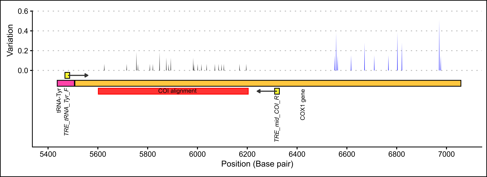

# Chapter four: Evolutionary relationships of *Pseudocaranx* species {#evolutionaryRelationships}

## Introduction {#taxonomyIntroduction} 

### Current *Pseudocaranx* taxonomy

Delimiting species in the *Pseudocaranx* genus has proved difficult, resulting in several taxonomic revisions [@James1974]. From initially a single species, *Pseudocaranx dentex*, several species have subsequently been described that cover a wide geographic distribution. Located around the Juan Fernández Islands on the west coast of Chile, *Pseudocaranx chilensis* was split from *Pseudocaranx dentex* by @Dyer2010. In Tosa bay, Japan, genetic and morphological variation suggest that two species exist within *P. dentex* which are both distinct from *P. wrighti* and *P. chilensis* based on morphology and geography (@Masuda1995; @Yamaoka1992). In Australia, @James1974 observed specimens from southern Australia with variable vertebrae numbers that were subsequently identified by @Smith-Vaniz2006 as *P. wrighti* and *Pseudocaranx georgianus*. That study also identified a new species (*Pseudocaranx dinjerra*) from Western Australia and discussed specimens that likely represent another species occurring off southern Queensland and Lord Howe Island which they state, “definitely are neither *P. dinjerra* nor *P. wrighti*” (p. 97). 

The current taxonomy describes five species in the *Pseudocaranx* genus; *Pseudocaranx dentex* (Bloch & Schneider, 1801), *Pseudocaranx chilensis* (Guichenot, 1848), *Pseudocaranx wrighti* (Whitley, 1931), *Pseudocaranx georgianus* (Cuvier, 1833) and *Pseudocaranx dinjerra* [@Smith-Vaniz2006].

### *Pseudocaranx* in New Zealand {#taxonomyIntroductionCrypticSpecies}

Currently, *P. georgianus* is the only *Pseudocaranx* species known to occur in New Zealand waters. However, taxonomic studies have indicated that a cryptic species that may occur in New Zealand based on morphology. @James1974 observed specimens in Norfolk Island, Kermadec (Raoul) Island and the North Cape of New Zealand with fewer caudal vertebrae (fourteen) than *P. georgianus* from other regions of New Zealand. They did not consider this morphological difference enough to warrant considering it a different species. However, after re-examining the same specimens, @Smith-Vaniz2006 believe @James1974 underestimated other morphological characters that differentiate these specimens from *P. georgianus* from the rest of New Zealand. @Smith-Vaniz2006 claim these fish are "definitely neither *P. dinjerra* nor *P. wrighti*" (p.97). 

Despite the specific claim by @Smith-Vaniz2006 that the specimens they observed in the Kermadec (Raoul) Island and the North Cape of New Zealand are not *P. wrighti*, @Duffy2015 reports *P. wrighti* occurring in the both of these regions in a study recording the taxa occurring within the Kermadec Island Marine Reserve. Interestingly, their taxonomic classification was based partly on @Smith-Vaniz2006. 

Other sources do not describe *P. wrighti* occurring in these regions. They are reported to occur only in the southern half of Australia from Western Australia to New South Wales (@Fishbase2018, @Smith-Vaniz2006).

Preliminary genetic work has also found fish from south-eastern Australia which are distinct from fish from northern New Zealand [@Rowling2000]. However, it is unknown if these fish are distinct from *P. georgianus* from other regions in New Zealand or are the same species from the North Cape and the Kermadec Islands described by @James1974 and @Smith-Vaniz2006.

### Historical reliance on morphological characters {#taxonomyIntroductionRelianceMorpholohy}

Although many morphological features have been used to delimit species in this genus, such as head shape and the number of gill rakers, anal fin rays, dorsal rays, anal spines and scutes (see @James1974; @Smith-Vaniz2006), the total number of vertebrae and caudal vertebrae have important distinguishing features for *Pseudocaranx* species. The total vertebrae number was the only morphological feature that was measured which showed a clear difference between two genetically distinct *Pseudocaranx* groups in Japan (*P. dentex* (Type A) and another undescribed species (Type B)) [@Yamaoka1992]. Distinction of wild specimens of these two groups (Type A and Type B) using caudal vertebrae number was also supported by @Masuda1995. 

Caudal vertebrae number was the only character with no intra-species variation for Australian species of *Pseudocaranx*, unlike counts of three types of fin rays and three types of gill rakers in @Smith-Vaniz2006 for which frequency distributions overlap among species and caudal vertebrae count was one of the features used to describe many of the currently recognised *Pseudocaranx* species [@Smith-Vaniz2006]. Vertebrae number was also one of the morphological features used to combine five species described at the time to *Caranx georgianus* (later revised to *Pseudocaranx georgianus*) [@James1974]. Because of its comparative lack of intra-species variation, caudal vertebrae number has historically been an important component of delimiting *Pseudocaranx* species.

Importantly, @Masuda1995 found that a quarter of artificially reared *P. dentex* specimens had a greater number of vertebrae (25) than wild caught specimens (24) despite being genetically the same species. They postulated that this could have been triggered by the lower water temperatures in the artificial environment and speculated that differences in water temperature during the larval stage in a wild environment could affect this trait. It was also observed that *P. georgianus* in New Zealand (at the time described as *Caranx georgianus*) showed a regular increase in the proportion of fish with 24 vertebrae rather than 25 vertebrae with decreases in latitude [@James1974], where waters are generally cooler. It is unknown whether these represent genetically distinct species, or within species variation in vertebrae number possibly as a result of environmental temperature.

Other morphological characteristics have been used as the basis for separating species. Principal component analyses have found subtle groupings of *P. dinjerra*, *P. georgianus* and *P.sp. "dentex"* (a putative species off Queensland and Lord Howe Island) based on snout and upper jaw lengths, straight lateral line and anal-fin base lengths [@Smith-Vaniz2006]. @Yamaoka1992 found general differences among two genetic types of *P. dentex* found in Japan such as a the number of anal-rays, visibility of vertical stripes on the lateral side of juveniles and body size, although with the exception of vertebrae number, no consistent differences in morphology were found, similar findings were reported by @Masuda1995. For museum specimens of *Pseudocaranx* species sampled from a broad geographic range in Western Australian waters, @James1974 failed to find morphological variation beyond vertebrae number to support a previous separation of species in this region.

Although there is variation in morphological characters within the *Pseudocaranx* genus that may be associated with species level taxonomy, this variation is not obviously defined between species. The range of intra-species variation of most of these characters are reported to overlap between species (see @James1974; @Masuda1995; @Smith-Vaniz2006; @Yamaoka1992). In fact, even though the average number of dorsal-fin rays, anal-fin rays and pectoral-fin rays differ among species, many *P. wrighti*, *P. dinjerra*, *P. georgianus* individuals will show the same number of these characteristics. Researchers have delimited several species in the *Pseudocaranx* genus, but the taxonomy remains for the large part unresolved. Because of the lack of clear species-level delineation of morphological characters and the possible contribution of environmental variables to character variability, the current *Pseudocaranx* taxonomy, which is based entirely on morphology, requires phylogenetic verification. This will allow us to verify current *Pseudocaranx* taxonomy and identify morphologically cryptic species.

### Previous study

Two phylogenetic studies of the wider Carangidae family have been undertaken [@Damerau2018; @Santini2015] although they include a small number of *Pseudocaranx* species from a limited geographic range. @Santini2015 include only a single *P. dentex* specimen sampled from South of Cape Everard in Victoria (which is likely to be in fact *P. georgianus* given its sampling location) and a *P. wrighti* specimen sampled from Rottnest Island in Western Australia. @Damerau2018 includes a single *P. dentex* fish sampled from an archipelago of Cape Verde in the North Atlantic Ocean.  

At the genus level, only two studies have used genetic markers to inform the taxonomy of the *Pseudocaranx* species. @Yamaoka1992 revealed a cryptic species based on 28 isozyme and protein loci of 94 *P. dentex* specimens from Japan, which was later supported by an analysis of the 16S-rRNA DNA sequences of 24 fish [@Masuda1995]. Genetic differences between *P. georgianus* (labelled as *P. dentex* at the time) and *P. wrighti* within southern Australian waters based on control region sequences of 59 fish have also been reported [@Bearham2004]. 

A comprehensive phylogenetic study of all *Pseudocaranx* species found in Australasia has not yet been undertaken and the relationships of *P. georgianus* from New Zealand has not been investigated. Importantly, the current management of New Zealand *P. georgianus* fisheries rely on the assumption that *P. georgianus* within Quota Management Areas are composed only of *P. georgianus*.

## Materials and methods

The partial COI sequences of four species in the *Pseudocaranx* genus (*P. dentex*, *P. dinjerra*, *P. georgianus* and *P. wrighti*) were either procured or sequenced in this thesis. Sequenced were obtained from The National Center of Biotechnology Information (NCBI) GenBank database, the Barcode of Life data System (BOLD Systems) or private sources. Additional COI sequences were produced using DNA extracted from *P. georgianus* tissue samples sampled in this thesis and primers designed in this thesis (see Chapter \@ref(fieldAndLab) for further information). Sequencing of these PCR products was carried out using a ABI 3730 Sequencer at Massey University Sequencing and Genotyping Services in Palmerston North, New Zealand

The editing of the DNA sequences and alignment was carried out in Geneious version 11.1.5 [@Kearse2012] The *Pseudocaranx* sequences and one outgroup (*Seriola lalandi*, GenBank accession: [KM877619](https://www.ncbi.nlm.nih.gov/nuccore/KM877619)) were aligned using the Geneious alignment tool with the default settings (Alignment type: global alignment with free end gaps, Cost matrix: 65% similarity, Gap open penalty: 12, Gap extension penalty: 3, Refinement iterations: 2). The alignments were manually edited to removed base pair calling noise and areas were the primer had been incorporated into the sequence. The chromatogram files of the DNA sequences were visually checked for signal strength and unambiguous base calling. The final alignment covered a 602 base pair region of the COI gene, excluding the first 96 and last 853 base-pairs of the gene (see Figure \@ref(fig:primersCoi) and see Figure \@ref(fig:alignmentCoi1) in the Appendix for the final COI gene alignment).

A nucleotide substitution model appropriate for the COI gene of this genus was estimated by using jModelTest version 2.1.10 [@Darriba2012, @Guindon2003]. The final COI alignment was used to test 88 models including those with equal–unequal base frequencies (+F), with–without a proportion of invariable sites (+I) and with–without rate heterogeneity among sites (+G). Eleven substitution schemes were explored using a Maximum Likelihood base tree for likelihood calculations. The model with the highest Bayesian Information Criterion (BIC) support was HKY+G and was used for phylogenetic analyses. 

Phylogenetic inference of the *Pseudocaranx* genus was based on both maximum likelihood and Bayesian inference. Both phylogenies were created using plugins within Geneious version 11.1.5 [@Kearse2012] (PHYML plugin version 2.2.4 [@Guindon2010] and MrBayes plugin version 2.2.4 [@Huelsenbeck2001]). The appropriate transition/transversion ratio and gamma distribution parameter was specified in the maximum likelihood phylogeny and branch support was given by 100 bootstrap replicates. The gene genealogies for the Bayesian phylogeny were explored using four MCMC chains 1,100,000 in length and 0.2 chain temperature. There was a burn in of 100,000 samples after which every 200^th^ gene genealogy was sampled.

```{r, eval = FALSE}
varCoiGeorgianus <- read.csv("data/07-evolutionaryRelationships/consensusIdentitiesCoiGeorgianus.csv") %>%
  mutate(variability = (1-identity))

varCoiGeorgianus2 <- read.csv("data/07-evolutionaryRelationships/consensusIdentitiesCoiGeorgianus2.csv") %>%
  mutate(variability = (1-identity))

varCoiGeorgianus3 <- read.csv("data/07-evolutionaryRelationships/consensusIdentitiesCoiGeorgianus3.csv") %>%
  mutate(variability = (1-identity))

# To plot
anns <- read.csv("data/05-mitogenome/annotations.csv") %>%  
  filter(annotation == "COX1 gene" | annotation == "TRE_tRNA_Tyr_F" | annotation == "TRE_mid_COI_R" | type == "tRNA")

# To label
labels <- read.csv("data/05-mitogenome/annotations.csv") %>%  
  filter(annotation == "COX1 gene" | annotation == "TRE_tRNA_Tyr_F" | annotation == "TRE_mid_COI_R" | type == "tRNA") %>% 
  mutate(middle = min + max) %>%
  mutate(middle = middle/2)

coi <- anns %>%
  filter(annotation == "COX1 gene")

primerF <- anns %>%
  filter(annotation == "TRE_tRNA_Tyr_F")

primerR <- anns %>%
  filter(annotation == "TRE_mid_COI_R")

trna <- anns %>%
  filter(type == "tRNA")

ggplot() +
  theme_clean(base_size = 13) +
  geom_area(data = varCoiGeorgianus2, aes(x = position, y = variability), color = "grey70", fill = "grey70") +
  geom_area(data = varCoiGeorgianus, aes(x = position, y = variability), color = "grey30", fill = "grey30") +
  geom_area(data = varCoiGeorgianus3, aes(x = position, y = variability), color = "grey70", fill = "grey70") +
  geom_rect(data = primerF, aes(xmin = min, ymin = -0.08, xmax = max, ymax = -0.02), fill = "yellow", color = "black", alpha = 0.8) +
  geom_rect(data = trna, aes(xmin = min, ymin = -0.10, xmax = max, ymax = -0.16), fill = "deeppink", color = "black", alpha = 0.8) +
  geom_rect(data = coi, aes(xmin = min, ymin = -0.10, xmax = max, ymax = -0.16), fill = "darkgoldenrod1", color = "black", alpha = 0.8) +  
  geom_rect(data = primerR, aes(xmin = min, ymin = -0.18, xmax = max, ymax = -0.24), fill = "yellow", color = "black", alpha = 0.8) +
  geom_rect(aes(xmin = 5602, ymin = -0.18, xmax = 6204, ymax = -0.24), fill = "red", color = "red", alpha = 0.8) +
  geom_text(data = labels, mapping = aes(x = labels$middle, y = -0.28, label = annotation), hjust = "right", size = 2, angle = 90, check_overlap = TRUE) +
  annotate("segment", x = 5480, xend = 5560, y = -0.05, yend = -0.05, colour = "grey21", size = 0.7, arrow=arrow(length = unit(0.15, "cm"), type = "closed")) +
  annotate("segment", x = 6320, xend = 6240, y = -0.21, yend = -0.21, colour = "grey21", size = 0.7, arrow=arrow(length = unit(0.15, "cm"), type = "closed")) +
  labs(x = "Position (Base pair)", y = "Variation") +
  scale_x_continuous(limits = c(5420, 7060), breaks = scales::pretty_breaks(n = 10)) +
  scale_y_continuous(limits = c(-0.6, 0.6), breaks = scales::pretty_breaks(n = 5))

ggsave(file = "images/07-evolutionaryRelationships/coiPrimers.svg", width = 9, height = 3, device = "svg", units = "in")
```

```{r primersCoi, out.width = "100%", fig.align = "center", fig.cap = "COI primer binding locations and within species variation among thirty *P. georgianus* individuals from New Zealand (black) and thirteen broodstock *P. georgianus* (blue)."}

```

## Results {#taxonomyResults}

In total, partial COI sequences for eight *P. dentex*, five *P. dinjerra*, thirty *P. georgianus* and sixteen *P. wrighti* individuals were either procured or sequenced (see Table \@ref(fig:phylogenyLabels)).

The best fit nucleotide substitution model was a HKY+G model (freqA = 0.2255, freqC = 0.2990, freqG = 0.1809, freqT = 0.2946, transition/transversion ratio = 7.4435, gamma shape = 0.201).

Both phylogenies had congruent overall topologies, although the branch support was variable between the two inference types (see Figures \@ref(fig:phylogenyCoiMaxLikelihood) and \@ref(fig:phylogenyCoiBayes)). Typically, the maximum likelihood phylogeny gave lower support values (MLsupport) for branches compared to the Bayesian phylogeny (Bsupport). Despite this, both phylogenies returned 4 overall clades:  

1. *P. georgianus*/*P. dentex* complex (clade 1)
2. *P. dentex* complex (clade 2)
3. *P. dinjerra* clade (clade 3)
4. *P. wrighti* clade (clade 4) 

See Figure \@ref(fig:cladeLocations) and Table \@ref(fig:phylogenyLabels) for the sampling locations of *Pseudocaranx* species from these four phylogenetic clades.
  
Both phylogenies congruently returned *P. wrighti* as a monophyletic clade with high support (MLsupport: 70, Bsupport: 1). This *P. wrighti* clade was distinguished from the *P. georgianus*/*P. dentex*/*P. dinjerra* complex comprised of three sister clades (clade 1, 2 and 3) by the Bayesian phylogeny (Bsupport: 1), although the support for the maximum likelihood phylogeny was low (MLsupport: 54).

One of the sister clades in the *P. georgianus*/*P. dentex*/*P. dinjerra* complex was a paraphyletic group including all *P. georgianus* individuals sampled throughout Australia and New Zealand and two *P. dentex* individuals sampled from Rottnest Island in Western Australia and Cape Everard in Victoria (*P. dentex 02* and *P. dentex 06*). This clade again had high support from the Bayesian phylogeny (Bsupport: 0.93) but low support from the maximum likelihood phylogeny (MLsupport: 54). The rest of the *P. dentex* individuals sampled from a broad range of locations (Israel, South Africa, Queensland, French Polynesia and the United States of America) (*P. dentex 01*, *P. dentex 03*, *P. dentex 04*, *P. dentex 05*, *P. dentex 07* and *P. dentex 08*) represented a second monophyletic sister clade with high support (MLsupport: 78, Bsupport: 1). The third sister clade included *P. dinjerra* individuals sampled from the Aborolhos Islands in Western Australia, with high support in the Bayesian phylogeny (Bsupport: 1) and the maximum likelihood phylogeny (MLsupport: 98).

Within the four overall clades, some individuals were more closely related to each other than to the rest of the individuals in their clade. Within clade 1, there were two grouping of *P. georgianus* individuals:

1. Three *P. georgianus* individuals from Victoria in Australia (*P. georgianus 07*), Gisborne in New Zealand (*P. georgianus 16*) and Geographe Bay in Western Australia (*P. georgianus 24*) are grouped together with high support in the Bayesian phylogeny (Bsupport: 0.95). 
2. Three *P. georgianus* individuals from Raglan in New Zealand (*P. georgianus 12*), Rottnest Island in Western Australia (*P. georgianus 20*) and Geraldton in Western Australia (*P. georgianus 29*) are grouped together with low support (Bsupport: 0.66). 

Both *P. georgianus* groupings were not supported in the maximum likelihood phylogeny. Within clade 2, the *P. dentex* individual from Israel was the most distantly related to the rest of the *P. dentex* within this clade, with the rest of the clade sampled from South Africa, Queensland, French Polynesia and the United States of America, grouped together with high support in both phylogenies (MLsupport: 78, Bsupport: 0.95). Within clade 3, three pairs of *P. wrighti* were grouped:

1. *P. wrighti 04* from Rottnest Island and *P. wrighti 15* from Warnbro Sound in Western Australia (MLsupport: 70, Bsupport: 0.97).
2. *P. wrighti 07* from Victoria and *P. wrighti 12* from Warnbro Sound in Western Australia.
3. *P. wrighti 02* from Rottnest Island and *P. wrighti 16* from Cockburn Sound in Western Australia (MLsupport: 61, Bsupport: 0.88).

```{r phylogenyCoiMaxLikelihood, out.width = "100%", fig.align = "center", fig.cap = "Maximum likelihood *Pseudocaranx* phylogeny including bootstrap support greater than 50."}

```

```{r phylogenyCoiBayes, out.width = "100%", fig.align = "center", fig.cap = "Bayesian *Pseudocaranx* phylogeny including posterior probabilities greater than 0.5."}

```

```{r, eval = FALSE}
sequences <- read.csv("data/06-fieldAndLab/dnaSequences.csv", stringsAsFactors = FALSE, header = TRUE)
sequences$location.latitude <- as.double(sequences$location.latitude)
sequences$location.longitude <- as.double(sequences$location.longitude)

clade1georgianus <- dplyr::filter(sequences, species == "P. georgianus" & phylogenetic.clade == "1")
clade1dentex <- dplyr::filter(sequences, species == "P. dentex" & phylogenetic.clade == "1")

leaflet() %>%
   setView(85, -8, zoom = 5) %>%  
   addCircles(data = clade1georgianus,
              lat = ~location.latitude, 
              lng = ~location.longitude,
              radius = 200000,
              color = "red",
              fillOpacity = 0.6)  %>%
     addCircles(data = clade1dentex,
              lat = ~location.latitude, 
              lng = ~location.longitude,
              radius = 200000,
              color = "#EA7AFF",
              fillOpacity = 0.6)  %>%
   addProviderTiles(providers$Esri.WorldImagery, options = providerTileOptions(opacity = 0.7)) %>%
   mapshot(file = "images/07-evolutionaryRelationships/clade1.png", vwidth = 5000, vheight = 3100)
```

```{r, eval = FALSE}
sequences <- read.csv("data/06-fieldAndLab/dnaSequences.csv", stringsAsFactors = FALSE, header = TRUE)
sequences$location.latitude <- as.double(sequences$location.latitude)
sequences$location.longitude <- as.double(sequences$location.longitude)

clade2 <- dplyr::filter(sequences, phylogenetic.clade == "2")

leaflet() %>%
   setView(85, -8, zoom = 5) %>%  
   addCircles(data = clade2,
              lat = ~location.latitude, 
              lng = ~location.longitude,
              radius = 200000,
              color = "#EA7AFF",
              fillOpacity = 0.6)  %>%
   addProviderTiles(providers$Esri.WorldImagery, options = providerTileOptions(opacity = 0.7)) %>%
   mapshot(file = "images/07-evolutionaryRelationships/clade2.png", vwidth = 5000, vheight = 3100)
```

```{r, eval = FALSE}
sequences <- read.csv("data/06-fieldAndLab/dnaSequences.csv", stringsAsFactors = FALSE, header = TRUE)
sequences$location.latitude <- as.double(sequences$location.latitude)
sequences$location.longitude <- as.double(sequences$location.longitude)

clade3 <- dplyr::filter(sequences, phylogenetic.clade == "3")

leaflet() %>%
   setView(85, -8, zoom = 5) %>%  
   addCircles(data = clade3,
              lat = ~location.latitude, 
              lng = ~location.longitude,
              radius = 200000,
              color = "yellow",
              fillOpacity = 0.6)  %>%
   addProviderTiles(providers$Esri.WorldImagery, options = providerTileOptions(opacity = 0.7)) %>%
   mapshot(file = "images/07-evolutionaryRelationships/clade3.png", vwidth = 5000, vheight = 3100)
```

```{r, eval = FALSE}
sequences <- read.csv("data/06-fieldAndLab/dnaSequences.csv", stringsAsFactors = FALSE, header = TRUE)
sequences$location.latitude <- as.double(sequences$location.latitude)
sequences$location.longitude <- as.double(sequences$location.longitude)

clade4 <- dplyr::filter(sequences, phylogenetic.clade == "4")

leaflet() %>%
   setView(85, -8, zoom = 5) %>%  
   addCircles(data = clade4,
              lat = ~location.latitude, 
              lng = ~location.longitude,
              radius = 200000,
              color = "chartreuse",
              fillOpacity = 0.6)  %>%
   addProviderTiles(providers$Esri.WorldImagery, options = providerTileOptions(opacity = 0.7)) %>%
   mapshot(file = "images/07-evolutionaryRelationships/clade4.png", vwidth = 5000, vheight = 3100)
```

```{r cladeLocations, out.width = "100%", fig.align = "center", fig.cap = "Sampling locations of the four major *Pseudocaranx* phylogenetic clades including *P. georgianus* (red), *P. dentex* (purple), *P. dinjerra* (yellow) and *P. wrighti* (green)."}
knitr::include_graphics("imagesFinal/07-evolutionaryRelationships/clades.png")
```

```{r phylogenyLabels, fig.cap = "Information on all COI sequences that were acquired or sequenced for *Pseudocaranx species."}
sketch = htmltools::withTags(table(
  class = 'display',
  thead(
    tr(
      th(colspan = 1, ""),
      th(colspan = 2, "Sampling location"),
      th(colspan = 4, "")
    ),
    tr(th(colspan = 1, "Label"),
       th(colspan = 1, "Region"),
       th(colspan = 1, "Area"),
       th(colspan = 1, "Source"),
       th(colspan = 1, "Genbank accession"),
       th(colspan = 1, "BOLD ID"),
       th(colspan = 1, "Museum ID")
  )
)
))

read.csv("data/06-fieldAndLab/dnaSequences.csv", stringsAsFactors = FALSE, header = TRUE, na.strings = c("")) %>%
  dplyr::filter(gene == "COI") %>%
  arrange(by_group = phylogeny.code) %>%
  dplyr::select(phylogeny.code, location.country, location.general, source, genbank.accession, bold.id, museum.id) %>%
  DT::datatable(rownames = FALSE,
                container = sketch,
                filter = 'top',
                class = 'hover order-column',
                options = list(pageLength = 10, autoWidth = TRUE))
```

## Discussion

This phylogenetic analysis as a whole supported the current taxonomy of the *Pseudocaranx* genus, with clear genetic support for the grouping of *P. wrighti* and *P. dinjerra*. Although, the taxonomic distinction of *P. dentex* and *P. georgianus* was not as clearly distinguished. Despite most *P. dentex* individuals being placed in a monophyletic group, two *P. dentex* individuals were placed within a well-supported group along with all *P. georgianus* individuals from Australasia. The grouping of these *P. dentex* individuals within clade 1 could be due them being *P. georgianus* individuals which are taxonomically mislabeled. Since these *P. dentex* specimens were sampled in 1994 (*P. dentex 06*) and 2006 (*P. dentex 02*), it is possible that they are *P. georgianus* specimens that have not been relabeled since the taxonomic revision of previously described *P. dentex* to *P. georgianus* by @Smith-Vaniz2006. To confirm this, the specimens could be taxonomically inspected if these fish remain in the CSIRO, Australian National Fish Collection. If these specimens were confirmed to be *P. georgianus* it would mean that the current taxonomic classifications of all four of the species are genetically supported by the COI gene. Additionally, no evidence was found on the COI gene of a single *P. georgianus* fish caught off the North Cape of New Zealand (*P. georgianus 15*) to support the claim that a cryptic species may be occuring in this region (see @Smith-Vaniz2006).

All fish in this study were sampled from locations where the species is known to occur, providing no evidence to revise current species boundaries and distribution. The species sampled from the largest geographic range was *P. georgianus* and fish from this species were sampled from around the North Island of New Zealand and southern Australia. *P. wrighti* is known to occur from Western Australia, southern Australia to New South Wales @Fishbase2018. This study only identified *P. wrighti* from areas within this geographic range, supporting the current species boundaries. *P. dinjerra* were sampled from only one location from the limited range where it is known to occur, on the west coast of Western Australia @Fishbase2018. *P. dinjerra* occurrence data is limited and this species may occur in a wider geographic range. In order to validate the edges of *Pseudocaranx* species’ boundaries, taxonomic and genetic work should be undertaken on individuals sampled from a broader geographic range. This would be particularly important for species where fish were sampled from a limited geographic range in this study such as *P. wrighti* or for which limited species occurrence data is available such as *P. dinjerra*.

*P. dentex* has the largest geographic range, occurring in many regions worldwide [@Fishbase2018]. A greater number of *Pseudocaranx* species have been identified within Australasia than any other area of the world. This likely reflects the fact that taxonomic work has been focused on *Pseudocaranx* species in Australasia. Where taxonomic or genetic work has been undertaken, cryptic species have been identified. For example, in Japan (@Masuda1995; @Yamaoka1992), Australasia (@James1974; @Smith-Vaniz2006) and Chile [@Dyer2010]. In this chapter, one *P. dentex* individual sampled from Israel was genetically distinct from other *P. dentex* from South Africa, French Polynesia and the USA. Given that *P. dentex* occurs over a very large geographic range, it is likely that there are other cryptic species within *P. dentex*.

In some cases, individuals within a species were closely related despite large distances between the locations they were sampled. *P. georgianus* individuals from the east coast of New Zealand and the west coast of Australia were closely related. Similarly, *P. wrighti* from Victoria and Western Australia were closely related. This genetic connection within species over long distances could indicate either gene flow between remote regions from migrants or a common ancestral history. Teasing apart these variables could be achieved through population genetic or tag-recapture studies based in *Pseudocaranx* biology.