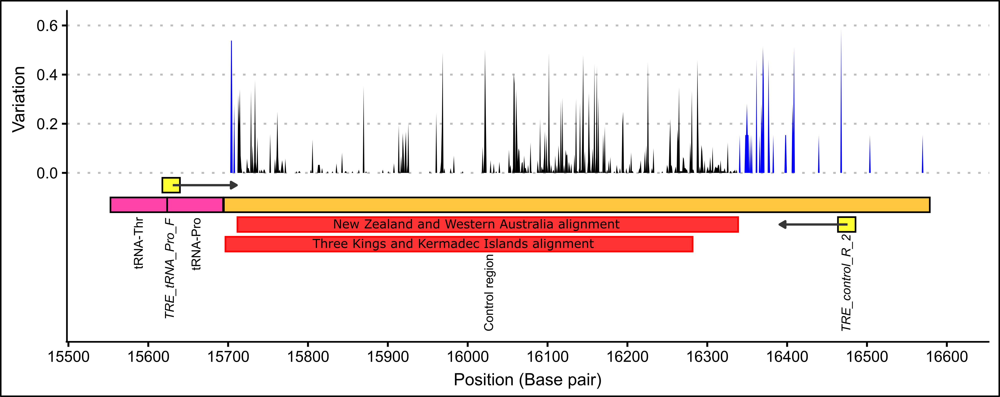
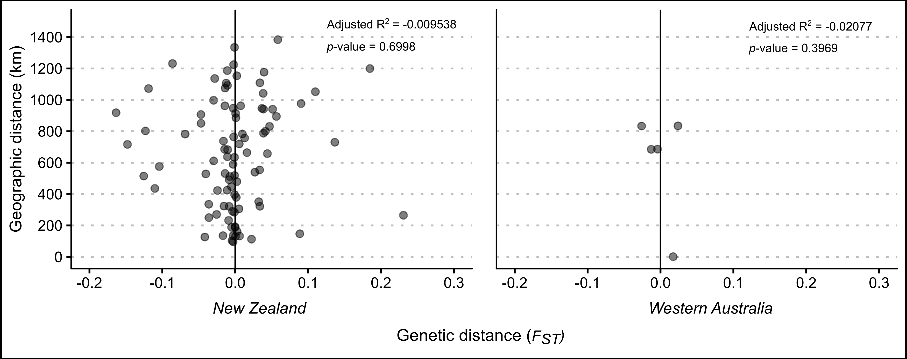
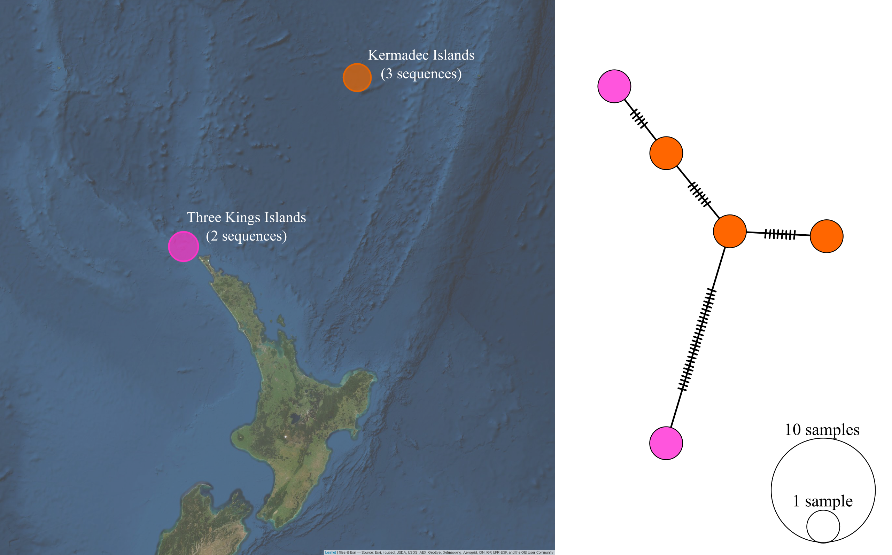
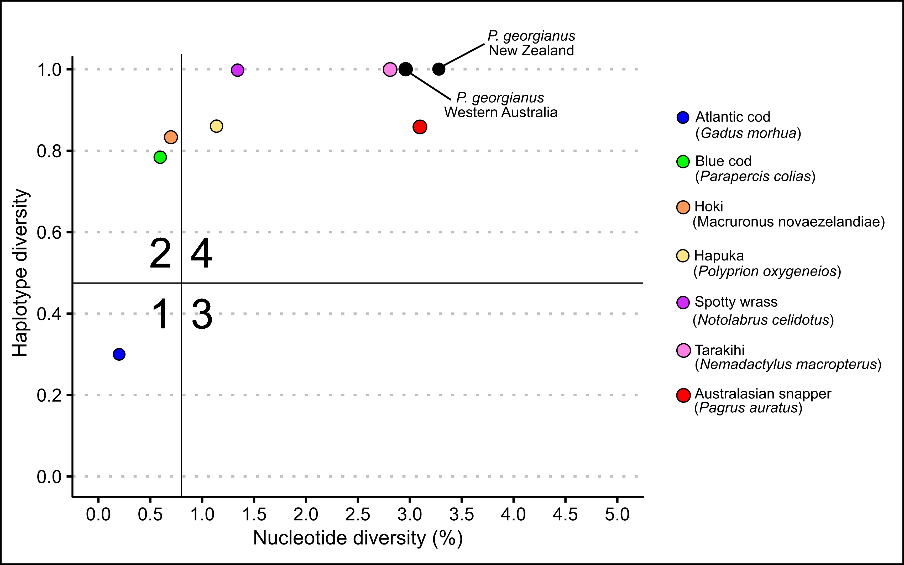
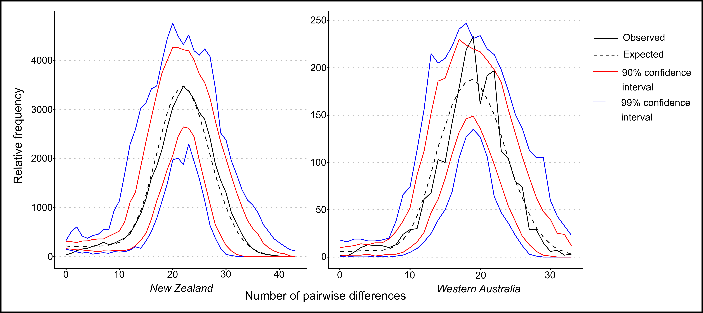
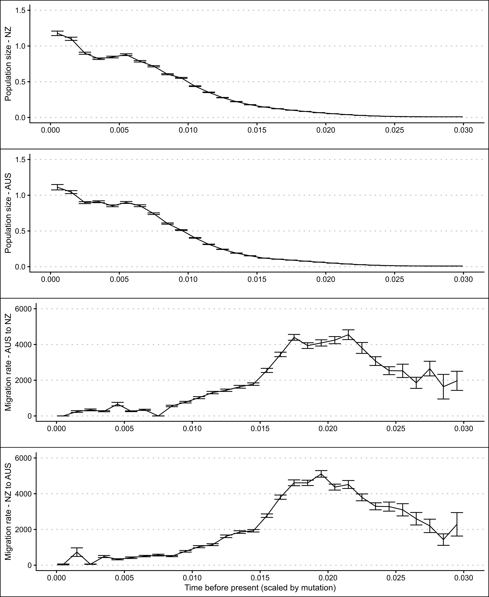

# Chapter five: Population stucture and demographic history of *P. georgianus* {#popStructure}

## Introduction

### Population structure of New Zealand *P. georgianus* {#popStructureNZ}

*P. georgianus* is the only *Pseudocaranx* species currently known to occur in New Zealand waters. However, taxonomic studies have indicated a cryptic species that may occur in New Zealand based on the morphology of specimens in Norfolk Island, Kermadec (Raoul) Island and the North Cape of New Zealand (see @Smith-Vaniz2006; @James1974). At present, the literature is unclear on what species these fish represent (see Section \@ref(taxonomyIntroduction)).

Putative sub-stocks of *P. georgianus* in New Zealand have also been reported. Based on the most recent plenary document from the Ministry for Primary Industries (MPI), stock assessments have been conducted for three of the five *P. georgianus* Quota Management Areas (QMA’s), TRE1, TRE2 and TRE7 where commercial fishing is focused [@MPI2018]. Within TRE1, two biological stocks (East Northland to Hauraki Gulf and Bay of Plenty, see Figure \@ref(fig:putativeSubStocks)) are believed to exist based on time-series of catch at-age data. However, standardised bottom trawl catch per unit effort (CPUE) data and aerial sighting data produced conflicting results in age-based total catch-history assessment models, which meant no revisions were made to the stock assessments [@MPI2018].

Although TRE1 continues to be treated as one stock, an age based total catch-history assessment model became the basis for the Northern Inshore Working Group's recommendation to undertake further assessments of these areas [@MPI2018]. Modelling results found that stock abundance in TRE2 fluctuates with movement to and from this QMA, indicating that fish in TRE2 are likely to be part of the same biological stock as the Bay of Plenty (within TRE1) [@MPI2018]. Based on tag-recapture data by @James1978 of many fish, movement of *P. georgianus* was observed between these two regions. Stock assessments for TRE2 were also recommended by @MPI2018 to be conducted in parallel with TRE1 stock assessments. 

Spatial heterogeneity of age composition and trends in catch per unit effort (CPUE) data of *P. georgianus* from TRE7 suggest the presence of three biological stocks; Ninety Mile Beach, the core area of the fishery from Tauroa Point to North Taranaki Bight and South Taranaki Bight [@MPI2018]. A stock assessment for TRE7 was updated in 2015, although it was limited to only one part of one of these putative sub-stocks (Kaipara-Manukau-North Taranaki Bight, see Figure \@ref(fig:putativeSubStocks)) [@Langley2015]. These spatial stratifications were not included in stock models because the catch-at-age data was limited [@MPI2018]. No further information is available regarding the population structure of *P. georgianus* in New Zealand. 

### Population genetics

Understanding the population structure and taxonomy of fisheries species is an important basis for fisheries management [@Laikre2005; @Waples2008]. It minimises the risk of genetic depletion and inbreeding depression which is crucial to the ability for species to adapt to environmental pressures (@Allendorf2002; @Laikre2005) (see Section \@ref(generalIntroGeneticsAndManagement)). Currently, the management of New Zealand *P. georgianus* fisheries relies on the assumption that *P. georgianus* within TRE1, TRE2 and TRE7 comprise single biological stocks of a single species. 

Population genetic analyses can be used to investigate the population structure of species by constructing haplotype networks [@Paradis2018], testing for distinct stocks [@Excoffier1992] and testing for isolation by distance (@Meirmans2012; @Wright1943). It can also be used to understand the demographic history of a population or species. This will indicate how a population has responded to historical events, and in turn, provide information on how the population will respond to future environmental pressures (see Section \@ref(generalIntroPhylogeography)).
 
The control region is the most variable region of the *P. georgianus* mitogenome (see Section \@ref(mtGenomDescription)) and is therefore a useful DNA target for intraspecific analyses at the micro-evolutionary scale [@Avise1987] (see Section \@ref(molecularGenetics)). No studies have yet investigated the population genetics of New Zealand *P. georgianus*. However, such as study will provide insights into the population structure and demographic history of *P. georgianus* and will contribute to a robust management of *P. georgianus* fisheries. 

```{r putativeSubStock1, eval = FALSE}
# Two sub-stocks within TRE1
qma_outline <- shapefile("data/mapLayers/QMAs/Trevally.shp") %>% 
  st_as_sf() %>%
  dplyr::select("LayerName", "FishstockC", "Shape_STAr", "Shape_STLe", "geometry") %>%
  plyr::rename(c("FishstockC" = "location.qma"))

qma_transformed <- qma_outline %>% as_Spatial() %>% spTransform(CRS("+proj=longlat +datum=WGS84 +no_defs +lon_wrap=180"))

pal <- colorFactor(palette = c("indianred1"), levels = c("TRE1"))

leaflet() %>%
  setView(175.3, -38, zoom = 7) %>%
  addPolygons(data = qma_transformed,
              smoothFactor = 0.2,
              weight = 5, 
              color = "black",
              fillColor = ~pal(location.qma),
              fillOpacity = 0.4) %>%
  addProviderTiles(providers$Esri.WorldImagery, options = providerTileOptions(opacity = 0.85)) %>%
  mapshot(file = "images/08-popStructure/putativeSubStock1.png", vwidth = 2600, vheight = 1700)
```

```{r putativeSubStock2, eval = FALSE}
# Same stock BOP and TRE2
qma <- shapefile("data/mapLayers/QMAs/Trevally.shp") %>% 
  st_as_sf() %>%
  dplyr::select("LayerName", "FishstockC", "Shape_STAr", "Shape_STLe", "geometry") %>%
  plyr::rename(c("FishstockC" = "location.qma"))

qma_transformed <- qma %>% as_Spatial() %>% spTransform(CRS("+proj=longlat +datum=WGS84 +no_defs +lon_wrap=180"))

pal <- colorFactor(palette = c("indianred1"), levels = c("TRE1", "TRE2"))

leaflet() %>%
  setView(175.3, -38, zoom = 7) %>%
  addPolygons(data = qma_transformed,
              smoothFactor = 0.2,
              weight = 5, 
              color = "black",
              fillColor = ~pal(location.qma),
              fillOpacity = 0.4) %>%
  addProviderTiles(providers$Esri.WorldImagery, options = providerTileOptions(opacity = 0.85)) %>%
  mapshot(file = "images/08-popStructure/putativeSubStock2.png", vwidth = 2600, vheight = 1700)
```

```{r putativeSubStock3, eval = FALSE}
# Three sub-stocks within TRE7
qma <- shapefile("data/mapLayers/QMAs/Trevally.shp") %>% 
  st_as_sf() %>%
  dplyr::select("LayerName", "FishstockC", "Shape_STAr", "Shape_STLe", "geometry") %>%
  plyr::rename(c("FishstockC" = "location.qma"))

qma_transformed <- qma %>% as_Spatial() %>% spTransform(CRS("+proj=longlat +datum=WGS84 +no_defs +lon_wrap=180"))

pal <- colorFactor(palette = c("indianred1"), levels = c("TRE7"))

leaflet() %>%
  setView(175.3, -38, zoom = 7) %>%
  addPolygons(data = qma_transformed,
              smoothFactor = 0.2,
              weight = 5, 
              color = "black",
              fillColor = ~pal(location.qma),
              fillOpacity = 0.4) %>%
  addProviderTiles(providers$Esri.WorldImagery, options = providerTileOptions(opacity = 0.85)) %>%
  mapshot(file = "images/08-popStructure/putativeSubStock3.png", vwidth = 2600, vheight = 1700)
```

```{r putativeSubStocks, out.width = "70%", fig.align = "center", fig.cap = "Putative sub-stocks of *P. georgianus* in New Zealand.", fig.show = "hold"}
knitr::include_graphics(c("imagesFinal/08-popStructure/putativeSubStock1.png", "imagesFinal/08-popStructure/putativeSubStock2.png", "imagesFinal/08-popStructure/putativeSubStock3.png"))
```

## Materials and methods {#popStructureMethods}

Partial control region sequences of *P. georgianus* sampled in New Zealand and Western Australia were produced using DNA extracted from *P. georgianus* tissue samples sampled in this thesis and primers designed in this thesis (see Chapter \@ref(fieldAndLab) for further information). Sequencing of low yield control region PCR products was carried out using an ABI 3730 Sequencer at Massey University Sequencing and Genotyping Services in Palmerston North, New Zealand. Although majority of the control region sequencing was carried out by Macrogen in Seoul, the Republic of Korea.

Data preparation was undertaken in Geneious version 11.1.5 [@Kearse2012]. The chromatogram files of the DNA sequences were visually checked for signal strength and clear base calling. Poor quality sequences were excluded from further analyses such as sequences with a low signal to background signal. Sequence alignments were constructed using the Geneious alignment tool with the default settings (Alignment type: global alignment with free end gaps, cost matrix: 65% similarity, gap open penalty: 12, gap extension penalty: 3, refinement iterations: 2) and manually trimmed to remove base pair calling noise and primer binding locations. 

Two final NEXUS alignments were produced. The first included all sequences from New Zealand's North Island and Western Australia. A second alignment of five sequences for *P. georgianus* sampled from offshore New Zealand islands was created. These sequences were aligned separately since they were highly divergent and difficult to align to the control region sequences of *P. georgianus* sampled from the rest of New Zealand or Western Australia.

### Population structure {#popStructureMethods2}

The main alignment of control region sequences of *P. georgianus* sampled from New Zealand's North Island and Western Australia was used to make pairwise comparisons were made for each statistical area in New Zealand that was sampled. Pairwise comparisons were made using the pairwise difference distance and significance was established with 110 permutations.

The main alignment was also sub-set at the following levels to compare populations at different scales using haplotype networks and AMOVA's:

1. TRE2 and Bay of Plenty
2. Ninety Mile Beach (putative sub-stock 1), North Taranaki bight to Taurau (putative sub-stock 2) and South Taranaki Bight (putative sub-stock 3)
3. Quota Management Areas (TRE1, TRE2, TRE7)
4. New Zealand and Western Australia
5. Geraldton, East Augusta and Poison Creek
6. Juveniles, adults from New Zealand and adults from Western Australia
    
For the comparison of the New Zealand and Western Australian *P. georgianus* populations, a random sub-sample of the New Zealand population was taken to ensure the sample sizes were comparable. 

Because the control region has a high mutation rate and samples were taken over nine years, haplotype networks were chosen to be constructed over a phylogeny since some of the sequences could be ancestral to other sequences (see @Paradis2018). Furthermore, there was large amount of variation in how different algorithms such as estimated unobserved haplotypes, so a minimum spanning network algorithm was used to avoid estimating unobserved haplotypes while providing advantages over a minimum spanning tree method (see section \@ref(generalIntroPopStructure)).

Therefore, the presence of distinct populations was tested for by creating minimum spanning haplotypes networks (epsilon value of 0) for all population groupings in PopART version 1.7 [@Leigh2015]. Tests for population differentiation was also done in PopART version 1.7 [@Leigh2015] using analysis of molecular variance (AMOVA). The presence of continuous genetic change in the populations (isolation by distance) was tested by correlating geographic distance with genetic distance between fourteen statistical areas in New Zealand's North Island and three locations in Western Australia. The shortest geographic distance between localities was measured along the coastline using the measurement tool in Google Maps.

### Demographic history

The population structure identified in Section \@ref(popStructureMethods2) was used to investigate the demographic history of *P. georgianus*. The control region sequence data was grouped into two significantly genetically distinct populations from two locations; New Zealand's North Island and Western Australia. The full NEXUS alignment was imported into DNA Sequence Polymorphism version 6.12.3 [@Rozas2017] to identify all distinct *P. georgianus* haplotypes and create Arlequin input files. 

Basic demographic measures were calculated in Arlequin version 3.5.2.2 [@Excoffier2010]. The level and type of genetic variation within and between populations was calculated using pairwise differences and haplotype frequency counts. Tajima's D and Fu's F statistics were calculated using 1000 simulated steps. Mismatch distributions were based on the demographic expansion model and calculated with pairwise differences and 100 bootstrap replicates.

Mutation-scaled population sizes and migration rates over time were calculated in Migrate version 4.4.3 (@Beerli1998; @Beerli1999) on a remote high-performance cluster. Because the number of control region sequences for *P. georgianus* sampled in New Zealand were much higher than those from Western Australia, New Zealand *P. georgianus* sequences were sub-sampled in each model run using a random seed. Three migration models were explored:

1. Free migration in both directions between the two populations (AUS $\Leftrightarrow$ NZ)
2. Migration in only one direction from Western Australia to New Zealand (AUS $\Rightarrow$ NZ)
3. Migration in only one direction from New Zealand to Western Australia (NZ $\Rightarrow$ AUS)

These three models were run several times using different prior distributions and MCMC settings. Iterative model runs were undertaken until the whole posterior distribution of the mutation-scaled population sizes and immigration rates were sampled, the acceptance ratio of each parameter was roughly half, an adequate MCMC sample size was obtained and the autocorrelation of MCMC sampling was limited. The parameters of the final three model runs are outlined in Table \@ref(tab:migrateParameters). The three final model runs were compared to find the migration model with the highest support. The demographic history of both New Zealand and Western Australian populations of *P. georgianus* were estimated from the highest supported model.

```{r migrateParameters}
options(knitr.kable.NA = '-')
read.csv("data/08-popStructure/migrateParameters.csv", stringsAsFactors = FALSE, header = TRUE, na.strings=c("")) %>%
  knitr::kable(col.names = c("Parameter", "Value"), 
               caption = "Parameters of the final three migration model runs.",
               booktabs = TRUE,
               align = "r",
               escape = FALSE) %>%
  kable_styling(font_size = 11, position = "center", latex_options = "hold_position") %>%
  pack_rows("Data options", 1, 3) %>%
  pack_rows("Parameter start setting", 4, 6) %>%
  pack_rows("MCMC search strategies", 7, 18)
```

## Results

### Genetic data

The first NEXUS alignment covered a 640 base-pair region of the control region (see Figure \@ref(fig:primersControl)). In this alignment, no base pairs were manually edited because all sequences were high quality. This alignment was composed of control region sequences of 384 *P. georgianus*, 68 of which were sampled from three locations in Western Australia and 316 from off the coast of the North Island of New Zealand. The New Zealand sequences included thirteen juvenile *P. georgianus* caught from one location in Whangarei. Of the 303 adult *P. georgianus* from New Zealand, 139 were sampled from TRE1, 58 from TRE2 and 106 from TRE7. These samples were taken from fourteen statistical areas around the North Island of New Zealand. The 68 samples from Western Australia were comprised of 27 *P. georgianus* from Poison Creek, thirteen from Geraldton and 28 off East Augusta (see Table \@ref(fig:controlSequences)). 

The second alignment covered a 585 base-pair region of the control region (see Figure \@ref(fig:primersControl)) of three *P. georgianus* from the Kermadec Islands and two *P. georgianus* from Three Kings Islands. The strength of the signal of these sequences were generally lower and uncertain bases were edited conservatively. See the Appendix for both partial control region alignments (Figure \@ref(fig:alignmentControl1) and \@ref(fig:alignmentIslands)).

```{r, eval = FALSE}
var <- read.csv("data/05-mitogenome/consensusIdentities.csv") %>%
  mutate(variability = (1-identity))

varControl <- read.csv("data/05-mitogenome/consensusIdentitiesControl.csv") %>%
  mutate(variability = (1-identity))

varControl2 <- read.csv("data/05-mitogenome/consensusIdentitiesControl2.csv") %>%
  mutate(variability = (1-identity))

# To plot
anns <- read.csv("data/05-mitogenome/annotations.csv") %>%  
  filter(type == "D-loop" | annotation == "TRE_tRNA_Pro_F" | annotation == "TRE_control_R_2" | type == "tRNA")

# To label
labels <- read.csv("data/05-mitogenome/annotations.csv") %>%  
  filter(type == "D-loop" | annotation == "TRE_tRNA_Pro_F" | annotation == "TRE_control_R_2" | type == "tRNA") %>% 
  mutate(middle = min + max) %>%
  mutate(middle = middle/2)

dloop <- anns %>%
  filter(type == "D-loop")

primerF <- anns %>%
  filter(annotation == "TRE_tRNA_Pro_F")

primerR <- anns %>%
  filter(annotation == "TRE_control_R_2")

trna <- anns %>%
  filter(type == "tRNA")

ggplot() +
  theme_clean(base_size = 13) +
  geom_area(data = var, aes(x = position, y = variability), color = "grey70", fill = "grey70") +
  geom_area(data = varControl2, aes(x = position, y = variability), color = "grey30", fill = "grey30") +  
  geom_rect(data = primerF, aes(xmin = min, ymin = -0.08, xmax = max, ymax = -0.02), fill = "yellow", color = "black", alpha = 0.8) +
  geom_rect(data = trna, aes(xmin = min, ymin = -0.10, xmax = max, ymax = -0.16), fill = "deeppink", color = "black", alpha = 0.8) +
  geom_rect(data = dloop, aes(xmin = min, ymin = -0.10, xmax = max, ymax = -0.16), fill = "darkgoldenrod1", color = "black", alpha = 0.8) +  
  geom_rect(data = primerR, aes(xmin = min, ymin = -0.18, xmax = max, ymax = -0.24), fill = "yellow", color = "black", alpha = 0.8) +
  geom_rect(aes(xmin = 15711, ymin = -0.18, xmax = 16338, ymax = -0.24), fill = "red", color = "red", alpha = 0.8) + 
  geom_rect(aes(xmin = 15696, ymin = -0.26, xmax = 16281, ymax = -0.32), fill = "red", color = "red", alpha = 0.8) +
  geom_text(data = labels, mapping = aes(x = labels$middle, y = -0.36, label = annotation), hjust = "right", size = 2, angle = 90, check_overlap = TRUE) +
  annotate("segment", x = 15630, xend = 15710, y = -0.05, yend = -0.05, colour = "grey21", size = 0.7, arrow=arrow(length = unit(0.15, "cm"), type = "closed")) +
  annotate("segment", x = 16475, xend = 16390, y = -0.21, yend = -0.21, colour = "grey21", size = 0.7, arrow=arrow(length = unit(0.15, "cm"), type = "closed")) +
  labs(x = "Position (Base pair)", y = "Variation") +
  scale_x_continuous(limits = c(15550, 16600), breaks = scales::pretty_breaks(n = 10)) +
  scale_y_continuous(limits = c(-0.6, 0.6), breaks = scales::pretty_breaks(n = 5))

ggsave(file = "images/08-popStructure/controlPrimers.svg", width = 9, height = 3.5, device = "svg", units = "in")
```

```{r primersControl, out.width = "100%", fig.align = "center", fig.cap = "The alignment positions of two *P. georgianus* alignments showing the level of within species variation based on thirteen broodstock *P. georgianus* (blue) and 304 *P. georgianus* sampled in New Zealand (black)."}

```

### Pairwise comparisons

The $F_{ST}$ values among the majority of the sampled statistical areas in New Zealand were not significantly different (see Table: \@ref(tab:pairwiseFSTstatareas)). However, *P. georgianus* from five pairs of statistical areas were significantly different from one another (see Figure: \@ref(fig:differentStatAreas)). However, the genetic distance among them was typically small and the populations reside in regions isolated from one another, such as the West and East of New Zealand's North Island. Some moderate genetic distances were identified ($F_{ST}$: 0.18474, $p$-value: 0.01802+-0.0121 between statistical area 040 and 009) ($F_{ST}$: 0.10996, $p$-value: 0.00901+-0.0091 between statistical area 039 and 009) but were based on a very small number of samples so the relevance of these findings cannot be validated (see Figure: \@ref(fig:differentStatAreas)).

As demonstrated in Figure: \@ref(fig:differentStatAreas), some genetically distinct populations were identified with small genetic distances. *P. georgianus* from statistical are 041 off Raglan on the West Coast and 009 in the Bay of Plenty on the East Coast were significantly genetically distinct with an $F_{ST}$ of 0.02698 ($p$-value: 0.00901+-0.0091). However, statistical area 047 off the North Cape and 041 in the North Taranaki Bight ($F_{ST}$: 0.02698, $p$-value: 0.00901+-0.0091) are both located on the West Coast of New Zealand's North Island.

```{r pairwiseFSTstatareas, fig.cap = "Pairwise FST's of *P. georgianus* among fourteen statistical areas in New Zealand. FST's which are significant are highlighted in yellow."}
# Note: see the file "pairwiseDifferencesStatareasSignificance.csv" for the p-values associated with these pairwise differences
options(knitr.kable.NA = '-')
fst <- read.csv("data/08-popStructure/pairwiseDifferencesStatareas.csv", stringsAsFactors = FALSE, header = TRUE, na.strings = c("")) 
fst$statArea <- c("002", "003", "008", "009", "010", "011", "013", "016", "039", "040", "041", "042", "046", "047")
fst[9:11, 5] <- cell_spec(fst[9:11, 5], "latex", background = "yellow")
fst[9, 8] <- cell_spec(fst[9, 8], "latex", background = "yellow")
fst[14, 12] <- cell_spec(fst[14, 12], "latex", background = "yellow")
  knitr::kable(fst,
               col.names = c("Statistical Area", "002", "003", "008", "009", "010", "011", "013", "016", "039", "040", "041", "042", "046", "047"),
               caption = "Pairwise FST's of $\\textit{P. georgianus}$ among fourteen statistical areas in New Zealand. FST's which are significant are highlighted in yellow.",
             booktabs = TRUE,
             align = "r",
             linesep = "",
             escape = FALSE) %>%
  kable_styling(font_size = 8, position = "center", latex_options = "hold_position") %>%
  kable_styling(latex_options = "scale_down")
```

```{r eval = FALSE}
statarea <- shapefile("data/mapLayers/StatisticalAreas/StatisticalAreas.shp") %>% 
  st_as_sf() %>%
  dplyr::filter(LayerName == "General Statistical Areas") %>% 
  dplyr::select("LayerName", "Statistica", "SHAPE_STAr", "SHAPE_STLe", "geometry") %>%
  plyr::rename(c("Statistica" = "location.stat.area"))

statarea_transformed <-  statarea %>% as_Spatial() %>% spTransform(CRS("+proj=longlat +datum=WGS84 +no_defs +lon_wrap=180"))

pal <- colorFactor(palette = c("red"), levels = c("009", "013", "039", "040", "041", "047"))

leaflet() %>%
  setView(175.3, -38, zoom = 7) %>%
  addPolygons(data = statarea_transformed,
              smoothFactor = 0.2,
              weight = 2, 
              color = "black",
              fillColor = ~ pal(location.stat.area),
              fillOpacity = 0.4) %>%
  addProviderTiles(providers$Esri.WorldImagery, options = providerTileOptions(opacity = 0.7)) %>%
  mapshot(file = "images/08-popStructure/differentStatAreas.png", vwidth = 2600, vheight = 1700)
```

```{r differentStatAreas, out.width = "100%", fig.align = "center", fig.cap = "Statistical areas from which *P. georgianus* are genetically distinct (FST's are provided)."}
knitr::include_graphics("imagesFinal/08-popStructure/differentStatAreas.png")
```

### Test for isolation by distance

Scatterplots and linear regression models did not find evidence to suggest that geographic distance between samples predicts genetic distance of *P. georgianus* in either New Zealand's North Island, or Western Australia (see Figure: \@ref(fig:isolationByDistance)).

Three of the thirteen juveniles had the same haplotype as adult *P. georgianus* sampled from three locations in the East Coast of the North Island of New Zealand; Off Mangonui in Northland, Te Kaha in the Bay of Plenty and Hicks bay in East Cape (See Figure \@ref(fig:similarHaplotypes)). There were a further fifteen adult individuals with one SNP difference to a juvenile from Whangarei in the North-West and North-East of the North Island of New Zealand. A further eighteen adults had haplotypes with two SNP differences to a juvenile, ranging as far south as the Wellington Region. Adult *P. georgianus* with the same haplotype as a juvenile were found close to the juvenile sampling location in the north-east of New Zealand's North Island. The number and geographic range increased with increasing genetic differences from a juvenile.

```{r eval = FALSE}
isolationByDistanceNZ <- read.csv("data/08-popStructure/isolationByDistanceNZ.csv", header = TRUE)

isolationByDistanceAUS <- read.csv("data/08-popStructure/isolationByDistanceAUS.csv", header = TRUE)

NZ <- ggplot(data = isolationByDistanceNZ, aes(x = genetic.distance, y = distance.km)) +
  geom_point(alpha = 0.5) +
  theme_clean(base_size = 13) +
  labs(x = "Genetic distance (FST)", y = "Geographic distance (km)") +
  geom_vline(xintercept = 0) +
  scale_x_continuous(limits = c(-0.2, 0.3), breaks = scales::pretty_breaks(n = 6)) +
  scale_y_continuous(limits = c(0, 1500), breaks = scales::pretty_breaks(n = 6))

AUS <- ggplot(data = isolationByDistanceAUS, aes(x = genetic.distance, y = distance.km)) +
  geom_point(alpha = 0.5) +
  theme_clean(base_size = 13) +
  labs(x = "Genetic distance (FST)", y = "Geographic distance (km)") +
  geom_vline(xintercept = 0) +
  scale_x_continuous(limits = c(-0.2, 0.3), breaks = scales::pretty_breaks(n = 6)) +
  scale_y_continuous(limits = c(0, 1500), breaks = scales::pretty_breaks(n = 6))
  
arrangeGrob(NZ, AUS, nrow = 1, ncol = 2) %>%
   ggsave(file = "images/08-popStructure/isolationByDistance.svg", width = 9, height = 3, device = "svg", units = "in")
```

```{r isolationByDistance, out.width = "100%", fig.align = "center", fig.cap = "Relationship between geographic and genetic distance among $\\textit{P. georgianus}$ from New Zealand and Western Australia."}

```

```{r, eval = FALSE}
linearModNZ <- lm(genetic.distance ~ distance.km, data = isolationByDistanceNZ)
summary(linearModNZ)

linearModAUS <- lm(genetic.distance ~ distance.km, data = isolationByDistanceAUS)
summary(linearModAUS)
```

```{r, eval = FALSE}
spawningDistribution <- shapefile("data/mapLayers/FinfishSpawningDistributions/FinfishSpawningDistributions.shp") %>%
  st_as_sf()
annualJuvDist <- dplyr::filter(spawningDistribution, LayerName == "Trevally - Annual Juvenile Distribution")

haplotypes <- read.csv("data/08-popStructure/similarHaplotypesToJuveniles.csv", stringsAsFactors = FALSE) %>%
  dplyr::filter(no.diffs == "0")
haplotypes$location.latitude <- as.double(haplotypes$location.latitude)
haplotypes$location.longitude <- as.double(haplotypes$location.longitude)

leaflet(data = haplotypes) %>%
  setView(175.3, -38, zoom = 8) %>%
  addPolygons(data = annualJuvDist, 
              weight = 0.5, 
              fillOpacity = 0.4, 
              fillColor = "#54ff9f") %>%
  addCircleMarkers(lng = ~location.longitude, lat = ~location.latitude,
                   radius = 30,
                   color = "#FF0000",
                   opacity = 0.8,
                   fillOpacity = 0.6,
                   labelOptions = labelOptions(noHide = TRUE, textOnly = TRUE,
                                               style = list(
                                                 "font-style" = "italic",
                                                 "font-size" = "50px")))  %>%
  addCircleMarkers(lng = 174.412750, lat = -35.807000,
                   color = "#FF0000",
                   radius = 30,
                   opacity = 0.8,
                   fillOpacity = 0.6) %>%
  addProviderTiles(providers$Esri.WorldImagery, options = providerTileOptions(opacity = 0.7)) %>%
  mapshot(file = "images/08-popStructure/similarHaplotypes.png", vwidth = 2600, vheight = 1900)
```

```{r, eval = FALSE}
spawningDistribution <- shapefile("data/mapLayers/FinfishSpawningDistributions/FinfishSpawningDistributions.shp") %>%
  st_as_sf()
annualJuvDist <- dplyr::filter(spawningDistribution, LayerName == "Trevally - Annual Juvenile Distribution")

haplotypes <- read.csv("data/08-popStructure/similarHaplotypesToJuveniles.csv", stringsAsFactors = FALSE) %>%
  dplyr::filter(no.diffs == "1")
haplotypes$location.latitude <- as.double(haplotypes$location.latitude)
haplotypes$location.longitude <- as.double(haplotypes$location.longitude)

leaflet(data = haplotypes) %>%
  setView(175.3, -38, zoom = 8) %>%
  addPolygons(data = annualJuvDist, 
              weight = 0.5, 
              fillOpacity = 0.4, 
              fillColor = "#54ff9f") %>%
  addCircleMarkers(lng = ~location.longitude, lat = ~location.latitude,
                   radius = 30,
                   color = "#FF8C00",
                   opacity = 0.8,
                   fillOpacity = 0.6,
                   labelOptions = labelOptions(noHide = TRUE, textOnly = TRUE,
                                               style = list(
                                                 "font-style" = "italic",
                                                 "font-size" = "50px")))  %>%
  addCircleMarkers(lng = 174.412750, lat = -35.807000,
                   color = "#FF0000",
                   radius = 30,
                   opacity = 0.8,
                   fillOpacity = 0.6) %>%
  addProviderTiles(providers$Esri.WorldImagery, options = providerTileOptions(opacity = 0.7)) %>%
  mapshot(file = "images/08-popStructure/similarHaplotypes1.png", vwidth = 2600, vheight = 1900)
```

```{r, eval = FALSE}
spawningDistribution <- shapefile("data/mapLayers/FinfishSpawningDistributions/FinfishSpawningDistributions.shp") %>%
  st_as_sf()
annualJuvDist <- dplyr::filter(spawningDistribution, LayerName == "Trevally - Annual Juvenile Distribution")

haplotypes <- read.csv("data/08-popStructure/similarHaplotypesToJuveniles.csv", stringsAsFactors = FALSE) %>%
  dplyr::filter(no.diffs == "2")
haplotypes$location.latitude <- as.double(haplotypes$location.latitude)
haplotypes$location.longitude <- as.double(haplotypes$location.longitude)


leaflet(data = haplotypes) %>%
  setView(175.3, -38, zoom = 8) %>%
  addPolygons(data = annualJuvDist, 
              weight = 0.5, 
              fillOpacity = 0.4, 
              fillColor = "#54ff9f") %>%
  addCircleMarkers(lng = ~location.longitude, lat = ~location.latitude,
                   radius = 30,
                   color = "#FFD700",
                   opacity = 0.8,
                   fillOpacity = 0.6,
                   labelOptions = labelOptions(noHide = TRUE, textOnly = TRUE,
                                               style = list(
                                                 "font-style" = "italic",
                                                 "font-size" = "50px")))  %>%
  addCircleMarkers(lng = 174.412750, lat = -35.807000,
                   color = "#FF0000",
                   radius = 30,
                   opacity = 0.8,
                   fillOpacity = 0.6) %>%
  addProviderTiles(providers$Esri.WorldImagery, options = providerTileOptions(opacity = 0.7)) %>%
  mapshot(file = "images/08-popStructure/similarHaplotypes2.png", vwidth = 2600, vheight = 1900)
```

```{r similarHaplotypes, out.width = "60%", fig.align = "center", fig.cap = "Sampling locations of adult *P. georgianus* with the same haplotypes as juveniles caught in Whangarei (top) or haplotypes with one (middle) or two (bottom) single nucleotide differences.", fig.show = "hold"}
knitr::include_graphics(c("imagesFinal/08-popStructure/similarHaplotypes.png", "imagesFinal/08-popStructure/similarHaplotypes1.png", "imagesFinal/08-popStructure/similarHaplotypes2.png"))
```

### Test for distinct populations

A haplotype network of *P. georgianus* from the Bay of Plenty and TRE2 show these fish are highly genetically connected (see Figure \@ref(fig:haploTRE2andBOP)) and an AMOVA did not find evidence to suggest they are distinct stocks (see Table \@ref(fig:amovaTRE2andBOP)).

Within TRE7, the haplotype lineages among the three putative sub-stocks did not appear to be distinct (see Figure \@ref(fig:haploSubstocksTRE7)). However, an AMOVA analysis found evidence to suggest that at least one pair of putative sub-stocks were significantly genetically distinct at the 10% significance level ($F_{ST}$: 0.01004, $p$-value: 0.059) (see Table \@ref(fig:amovaSubstocksTRE7)). Pairwise comparisons identified that the first putative sub-stock (Ninety Mile Beach) was distinct from the third putative sub-stock (South Taranaki Bight) ($F_{ST}$: 0.03019, $p$-value: 0.039) (see Table: \@ref(fig:amovaAmongSubstocksTRE7)).

The control region sequences of *P. georgianus* from the Three Kings Islands and Kermadec Islands were highly divergent from the control region sequences of *P. georgianus* sampled around the North Island of New Zealand and Western Australia. Each of the five fish were distinct haplotypes. There were only five to eight single nucleotide differences between haplotypes from these regions. However, one fish sampled from the Three Kings Islands was highly divergent, with 25 single nucleotide differences from the its most similar haplotype from the Kermadec Islands (see Figure \@ref(fig:haploIslands)).

There was some subtle grouping of haplotypes of *P. georgianus* in New Zealand, however the groupings were not associated with QMA's (see Figure \@ref(fig:haploQMAs)). Instead, the haplotypes sampled from each of these three QMA's were highly genetically linked. An AMOVA did not find evidence to suggest *P. georgianus* haplotypes from TRE1, TRE2 and TRE7 are genetically distinct ($p$-value: 0.498, see Table \@ref(fig:amovaQMAs)). 

Haplotypes of juvenile *P. georgianus* from Whangarei were similar to the haplotypes of adult *P. georgianus* sampled from New Zealand's North Island. However, a few juvenile *P. georgianus* had haplotypes similar to adult *P. georgianus* from Western Australia (see Figure \@ref(fig:haploJuveniles)). No evidence was found to suggest that this juvenile population was genetically different from the adult *P. georgianus* sampled in New Zealand's North Island ($F_{ST}$: 0.00032, $p$-value = 0.328), however they were significantly different from *P. georgianus* sampled from Western Australia ($F_{ST}$: 0.03735, $p$-value < 0.001) (see Table \@ref(tab:amovaNzAusBabies)).

Within the Western Australian population of *P. georgianus*, there was a high level of haplotype connectivity and no obvious grouping of haplotypes associated with any of the three sampling locations (see Figure \@ref(fig:haploAus)). This was supported by an AMOVA that did not find evidence to suggest a genetic difference between *P. georgianus* from these locations (see Table \@ref(fig:amovaAus)). Interestingly, one pair of identical haplotypes were sampled from the two most distant sampling locations in Western Australia (Geraldton and Poison Creek, a minimum of roughly 1450 kilometers of coastline).

Several *P. georgianus* haplotypes in New Zealand and Western Australia were linked, although the haplotypes displayed some general grouping associated with these two sampling regions (see Figure \@ref(fig:haploNZandAUS)). This was supported by an AMOVA analysis that found evidence for genetic differences between haplotypes sampled from New Zealand and Western Australia ($F_{ST}$: 0.03517, $p$-value < 0.001) (see Table \@ref(fig:amovaNZandAUS).

```{r mapTRE2andBOP, eval = FALSE}
sampling_data <- read.csv("data/Trevally.csv", stringsAsFactors = FALSE, header = TRUE)
sampling_data$location.latitude <- as.double(sampling_data$location.latitude)
sampling_data$location.longitude <- as.double(sampling_data$location.longitude)

NZ <- sampling_data %>% 
  dplyr::filter(control.successfully.sequenced == "Y") %>%
  dplyr::filter(location.qma == "TRE2" | location.stat.area == "009" | location.stat.area == "010" )

qma_outline <- shapefile("data/mapLayers/QMAs/Trevally.shp") %>% 
  st_as_sf() %>%
  dplyr::select("LayerName", "FishstockC", "Shape_STAr", "Shape_STLe", "geometry") %>%
  plyr::rename(c("FishstockC" = "location.qma"))

qma_transformed <- qma_outline %>% as_Spatial() %>% spTransform(CRS("+proj=longlat +datum=WGS84 +no_defs +lon_wrap=180"))

pal <- colorFactor(palette = c("green"), levels = c("TRE2"))

leaflet() %>%
  setView(175.3, -38, zoom = 7) %>%
  addCircles(data = NZ,
             lat = ~location.latitude, 
             lng = ~location.longitude,
             radius = 20000,
             color = "white",
             opacity = 0.7,
             fillOpacity = 0.1)  %>%
  addPolygons(data = qma_transformed,
              smoothFactor = 0.2,
              weight = 5, 
              color = "black",
              fillColor = ~pal(location.qma),
              fillOpacity = 0.4) %>%
  addProviderTiles(providers$Esri.WorldImagery, options = providerTileOptions(opacity = 0.7)) %>%
  mapshot(file = "images/08-popStructure/mapTRE2andBOP.png", vwidth = 2600, vheight = 1700)
```

```{r haploTRE2andBOP, out.width = "100%", fig.align = "center", fig.cap = "Haplotype network and sampling locations of *P. georgianus* sampled from the Bay of Plenty and TRE2."}
knitr::include_graphics("imagesFinal/08-popStructure/haploTRE2andBOP.png")
```

```{r amovaTRE2andBOP, fig.cap = "AMOVA output comparing *P. georgianus* from TRE2 and Bay of Plenty."}
read.csv("data/08-popStructure/AMOVAs/TRE2andBOP.csv", stringsAsFactors = FALSE, header = TRUE, na.strings=c("")) %>%
  DT::datatable(colnames = c("", "Degrees of freedom", "Sum of squares", "Sigma squared", "Variation", "FST", "Significance"),
                class = 'hover order-column',
                options = list(pageLength = 10, autoWidth = TRUE))
```

```{r mapSubstocksTRE7, eval = FALSE}
# Three sub-stocks within TRE7
sampling_data <- read.csv("data/Trevally.csv", stringsAsFactors = FALSE, header = TRUE)
sampling_data$location.latitude <- as.double(sampling_data$location.latitude)
sampling_data$location.longitude <- as.double(sampling_data$location.longitude)

NZ <- sampling_data %>% 
  dplyr::filter(control.successfully.sequenced == "Y" & location.qma == "TRE7")

qma <- shapefile("data/mapLayers/QMAs/Trevally.shp") %>% 
  st_as_sf() %>%
  dplyr::select("LayerName", "FishstockC", "Shape_STAr", "Shape_STLe", "geometry") %>%
  plyr::rename(c("FishstockC" = "location.qma"))

qma_transformed <- qma %>% as_Spatial() %>% spTransform(CRS("+proj=longlat +datum=WGS84 +no_defs +lon_wrap=180"))

leaflet() %>%
  setView(175.3, -38, zoom = 7) %>%
  addCircles(data = NZ,
             lat = ~location.latitude, 
             lng = ~location.longitude,
             radius = 20000,
             color = "white",
             opacity = 0.7,
             fillOpacity = 0.1)  %>%
  addPolygons(data = qma_transformed,
              smoothFactor = 0.2,
              weight = 5, 
              color = "black",
              fillColor = "grey",
              fillOpacity = 0.4) %>%
  addProviderTiles(providers$Esri.WorldImagery, options = providerTileOptions(opacity = 0.7)) %>%
  mapshot(file = "images/08-popStructure/mapSubstocksTRE7.png", vwidth = 2600, vheight = 1700)
```

```{r haploSubstocksTRE7, out.width = "100%", fig.align = "center", fig.cap = "Haplotype network and sampling locations of *P. georgianus* from three putative substocks within TRE7."}
knitr::include_graphics("imagesFinal/08-popStructure/haploSubstocksTRE7.png")
```

```{r amovaSubstocksTRE7, fig.cap = "AMOVA output comparing *P. georgianus* from three putative substocks within TRE7."}
read.csv("data/08-popStructure/AMOVAs/SubstocksTRE7.csv", stringsAsFactors = FALSE, header = TRUE, na.strings=c("")) %>%
  DT::datatable(colnames = c("", "Degrees of freedom", "Sum of squares", "Sigma squared", "Variation", "FST", "Significance"),
                class = 'hover order-column',
                options = list(pageLength = 10, autoWidth = TRUE))
```

```{r amovaAmongSubstocksTRE7, fig.cap = "AMOVA output of three pairwise comparisons of three putative substocks of *P. georgianus* within TRE7."}
sketch = htmltools::withTags(table(
  class = 'display',
  thead(
    tr(
      th(colspan = 7, "Putative substock 1 and 2")
    ),
    tr(th(colspan = 1, ""),
       th(colspan = 1, "Degrees of freedom"),
       th(colspan = 1, "Sum of Squares"),
       th(colspan = 1, "Sigma squared"),
       th(colspan = 1, "Variation"),
       th(colspan = 1, "FST"),
       th(colspan = 1, "Significance")
  )
)
))

read.csv("data/08-popStructure/AMOVAs/amongSubstocksTRE7.csv", stringsAsFactors = FALSE, header = TRUE, na.strings = c("")) %>%
  slice(1:3) %>%
  DT::datatable(rownames = FALSE,
                class = 'hover order-column',
                container = sketch,
                options = list(pageLength = 10, autoWidth = TRUE))

sketch = htmltools::withTags(table(
  class = 'display',
  thead(
    tr(
      th(colspan = 7, "Putative substock 2 and 3")
    ),
    tr(th(colspan = 1, ""),
       th(colspan = 1, "Degrees of freedom"),
       th(colspan = 1, "Sum of Squares"),
       th(colspan = 1, "Sigma squared"),
       th(colspan = 1, "Variation"),
       th(colspan = 1, "FST"),
       th(colspan = 1, "Significance")
  )
)
))

read.csv("data/08-popStructure/AMOVAs/amongSubstocksTRE7.csv", stringsAsFactors = FALSE, header = TRUE, na.strings = c("")) %>%
  slice(4:6) %>%
  DT::datatable(rownames = FALSE,
                class = 'hover order-column',
                container = sketch,
                options = list(pageLength = 10, autoWidth = TRUE))

sketch = htmltools::withTags(table(
  class = 'display',
  thead(
    tr(
      th(colspan = 7, "Putative substock 1 and 3")
    ),
    tr(th(colspan = 1, ""),
       th(colspan = 1, "Degrees of freedom"),
       th(colspan = 1, "Sum of Squares"),
       th(colspan = 1, "Sigma squared"),
       th(colspan = 1, "Variation"),
       th(colspan = 1, "FST"),
       th(colspan = 1, "Significance")
  )
)
))

read.csv("data/08-popStructure/AMOVAs/amongSubstocksTRE7.csv", stringsAsFactors = FALSE, header = TRUE, na.strings = c("")) %>%
  slice(7:9) %>%
  DT::datatable(rownames = FALSE,
                class = 'hover order-column',
                container = sketch,
                options = list(pageLength = 10, autoWidth = TRUE))
```

```{r, eval = FALSE}
sampling_data <- read.csv("data/Trevally.csv", stringsAsFactors = FALSE, header = TRUE)
sampling_data$location.latitude <- as.double(sampling_data$location.latitude)
sampling_data$location.longitude <- as.double(sampling_data$location.longitude)

# Control region sequenced from three kings and kermadec islands
threeKings <- sampling_data %>% 
  dplyr::filter(museum.id == "P.055228/TS1" | 
                  museum.id == "P.0555282/TS1")

kerm <- sampling_data %>% 
  dplyr::filter(museum.id == "P.050352/TS1" | 
                  museum.id == "P.051968/TS1" | 
                  museum.id == "P.058319/TS1" )

leaflet() %>%
  setView(175.3, -35, zoom = 7) %>%
  addCircles(data = threeKings,
             lat = ~location.latitude, 
             lng = ~location.longitude,
             radius = 45000,
             color = "#FF33C9",
             opacity = 1,
             fillOpacity = 0.7)  %>%
    addCircles(data = kerm,
             lat = ~location.latitude, 
             lng = ~location.longitude,
             radius = 45000,
             color = "#E96500",
             opacity = 1,
             fillOpacity = 0.7)  %>%
  addProviderTiles(providers$Esri.WorldImagery, options = providerTileOptions(opacity = 0.7)) %>%
  mapshot(file = "images/08-popStructure/mapIslands.png", vwidth = 1700, vheight = 1700)
```

```{r haploIslands, out.width = "100%", fig.align = "center", fig.cap = "Haplotype network and sampling locations of *P. georgianus* from Three Kings Islands and Kermadec Islands."}

```

```{r, eval = FALSE}
sampling_data <- read.csv("data/Trevally.csv", stringsAsFactors = FALSE, header = TRUE)
sampling_data$location.latitude <- as.double(sampling_data$location.latitude)
sampling_data$location.longitude <- as.double(sampling_data$location.longitude)

# Control region sequenced from New Zealand
NZ <- sampling_data %>% 
  dplyr::filter(control.successfully.sequenced == "Y" & location.country == "new zealand")

qma <- shapefile("data/mapLayers/QMAs/Trevally.shp") %>% 
  st_as_sf() %>%
  dplyr::select("LayerName", "FishstockC", "Shape_STAr", "Shape_STLe", "geometry") %>%
  plyr::rename(c("FishstockC" = "location.qma"))

qma_transformed <- qma %>% as_Spatial() %>% spTransform(CRS("+proj=longlat +datum=WGS84 +no_defs +lon_wrap=180"))

qma_sample_n <- sampling_data %>%  
  dplyr::filter(control.successfully.sequenced=="Y") %>% 
  dplyr::group_by(location.qma) %>%
  count() %>%
  dplyr::right_join(qma, by = "location.qma")
qma_sample_n$sampled <- !is.na(qma_sample_n$n)


pal <- colorFactor(palette = c("#00C707","#FA127E","#12F0FF"), levels = c("TRE1","TRE2","TRE7"))

leaflet() %>%
  setView(175.3, -38, zoom = 7) %>%
  addCircles(data = NZ,
             lat = ~location.latitude, 
             lng = ~location.longitude,
             radius = 20000,
             color = "white",
             opacity = 0.7,
             fillOpacity = 0.1)  %>%
  addPolygons(data = qma_transformed,
              smoothFactor = 0.2,
              weight = 5, 
              color = "black",
              fillColor = ~pal(qma$location.qma),
              fillOpacity = 0.4) %>%
  addProviderTiles(providers$Esri.WorldImagery, options = providerTileOptions(opacity = 0.7)) %>%
  mapshot(file = "images/08-popStructure/mapQmas.png", vwidth = 2600, vheight = 1700)
```

```{r haploQMAs, out.width = "100%", fig.align = "center", fig.cap = "Haplotype network and sampling locations of Trevally from three Quota Management Areas in New Zealand."}
knitr::include_graphics("imagesFinal/08-popStructure/haploQMAs.png")
```

```{r amovaQMAs, fig.cap = "AMOVA output comparing Trevally from three Quota Management Areas (QMA's) in New Zealand."}
read.csv("data/08-popStructure/AMOVAs/QMAs.csv", stringsAsFactors = FALSE, header = TRUE, na.strings = c("")) %>%
  DT::datatable(colnames = c("", "Degrees of freedom", "Sum of squares", "Sigma squared", "Variation", "FST", "Significance"),
                class = 'hover order-column',
                options = list(pageLength = 10, autoWidth = TRUE))
```

```{r, eval = FALSE}
sampling_data <- read.csv("data/Trevally.csv", stringsAsFactors = FALSE, header = TRUE)
sampling_data$location.latitude <- as.double(sampling_data$location.latitude)
sampling_data$location.longitude <- as.double(sampling_data$location.longitude)

pal <- colorFactor(palette = c("#FF1010", "#03B315", "#12F0FF"), levels = c("new zealand", "australia", "babies"))

nz <- sampling_data %>%
  dplyr::filter(subsample1 == "Y" | group == "babies" | group == "australia")

leaflet(data = nz, options = leafletOptions(minZoom = 2)) %>%
  setView(146, -31, zoom = 7) %>%  
  addCircles(lat = ~location.latitude, 
             lng = ~location.longitude,
             radius = 40000,
             color = ~pal(nz$group),
             opacity = 0.7,
             fillOpacity = 0.1)  %>%
  addProviderTiles(providers$Esri.WorldImagery, options = providerTileOptions(opacity = 0.7)) %>%
  mapshot(file = "images/08-popStructure/mapNZAUSBabies.png", vwidth = 6300, vheight = 4100)
```

```{r haploJuveniles, out.width = "100%", fig.align = "center", fig.cap = "Haplotype network and sampling locations of juvenile *P. georgianus* from Whangarei (New Zealand), adult *P. georgianus* from Western Australia and adult *P. georgianus* from New Zealand."}
knitr::include_graphics("imagesFinal/08-popStructure/haploJuveniles.png")
```

```{r amovaNzAusBabies}
read.csv("data/08-popStructure/AMOVAs/NZAUSBabies.csv", stringsAsFactors = FALSE, header = TRUE, na.strings=c("")) %>%
  knitr::kable(col.names = c("", "Degrees of freedom", "Sum of squares", "Sigma squared", "Variation", "FST", "Significance"),
               caption = "AMOVA output comparing juveniles from Whangarei to adults in New Zealand and adults in Western Australia.",
               booktabs = TRUE,
               align = "r",
               linesep = "") %>%
  kable_styling(font_size = 11, position = "center", latex_options = "scale_down") %>%
  kable_styling(latex_options = "scale_down") %>%
  pack_rows("Juveniles and adults in New Zealand", 1, 3) %>%
  pack_rows("Juveniles and adults in Western Australia", 4, 6)
```

```{r, eval = FALSE}
sampling_data <- read.csv("data/Trevally.csv", stringsAsFactors = FALSE, header = TRUE)
sampling_data$location.latitude <- as.double(sampling_data$location.latitude)
sampling_data$location.longitude <- as.double(sampling_data$location.longitude)

aus <- sampling_data %>% 
  dplyr::filter(control.successfully.sequenced == "Y") %>%
  dplyr::filter(location.country == "australia")

pal <- colorFactor(palette = c("#FF1010", "#03B315", "blue"), levels = c("poison creek", "geraldton", "east augusta"))

leaflet(data = aus) %>%
  setView(127, -28, zoom = 8) %>%  
  addCircles(lat = ~location.latitude, 
             lng = ~location.longitude,
             radius = 25000,
             color = ~pal(aus$group2),
             opacity = 0.7,
             fillOpacity = 0.1)  %>%
  addProviderTiles(providers$Esri.WorldImagery, options = providerTileOptions(opacity = 0.7)) %>%
  mapshot(file = "images/08-popStructure/mapAus.png", vwidth = 6300, vheight = 4100)
```

```{r haploAus, out.width = "100%", fig.align = "center", fig.cap = "Haplotype network and sampling locations of *P. georgianus* from three locations in Western Australia."}
knitr::include_graphics("imagesFinal/08-popStructure/haploAustralia.png")
```

```{r amovaAus, fig.cap = "AMOVA output comparing *P. georgianus* from three regions in Western Australia."}
read.csv("data/08-popStructure/AMOVAs/AUS.csv", stringsAsFactors = FALSE, header = TRUE, na.strings=c("")) %>%
  DT::datatable(colnames = c("", "Degrees of freedom", "Sum of squares", "Sigma squared", "Variation", "FST", "Significance"),
                class = 'hover order-column',
                options = list(pageLength = 10, autoWidth = TRUE))
```

```{r, eval = FALSE}
sampling_data <- read.csv("data/Trevally.csv", stringsAsFactors = FALSE, header = TRUE)
sampling_data$location.latitude <- as.double(sampling_data$location.latitude)
sampling_data$location.longitude <- as.double(sampling_data$location.longitude)

pal <- colorFactor(palette = c("#FF1010", "#03B315"), levels = c("new zealand", "australia"))

AUSandNZ <- sampling_data %>% 
  dplyr::filter(control.successfully.sequenced == "Y") %>%
  dplyr::filter(subsample1 == "Y" | group == "australia")

leaflet(data = AUSandNZ, options = leafletOptions(minZoom = 2)) %>%
  setView(146, -31, zoom = 7) %>%   
  addCircles(lat = ~location.latitude, 
             lng = ~location.longitude,
             radius = 40000,
             color = ~pal(AUSandNZ$location.country),
             opacity = 0.7,
             fillOpacity = 0.1)  %>%
  addProviderTiles(providers$Esri.WorldImagery, options = providerTileOptions(opacity = 0.7)) %>%
  mapshot(file = "images/08-popStructure/mapausandnz.png", vwidth = 6300, vheight = 4100)
```

```{r haploNZandAUS, out.width = "100%", fig.align = "center", fig.cap = "Haplotype network and sampling locations of *P. georgianus* from New Zealand and Western Australia."}
knitr::include_graphics("imagesFinal/08-popStructure/haploNZandAUS.png")
```

```{r amovaNZandAUS, fig.cap = "AMOVA output comparing *P. georgianus* from New Zealand and Western Australia."}
read.csv("data/08-popStructure/AMOVAs/AUSandNZ.csv", stringsAsFactors = FALSE, header = TRUE, na.strings = c("")) %>%
  DT::datatable(colnames = c("", "Degrees of freedom", "Sum of squares", "Sigma squared", "Variation (%)", "FST", "Significance"),
                class = 'hover order-column',
                options = list(pageLength = 10, autoWidth = TRUE))
```

### Demographic history 

For the New Zealand and Western Australian populations of *P. georgianus*, there was a high level of haplotype diversity (0.9992 and 0.991 respectively) (see Table \@ref(fig:diversitySummary)) compared to other New Zealand fishery species such as Blue Cod (*Parapercis colias*) (@Gebbie2014; @Smith2012), Kahawai (*Arripis trutta*) [@Hodgson2011]. However, *P. georgianus* had a similar level of haplotype diversity to Spotty wrass (*Notolabrus celidotus*) (@Scott2010; @Wilcox2015), Tarakihi (*Nemadactylus macropterus*) and Australasian Snapper (*Pagrus auratus*). Both the New Zealand and Western Australian populations of *P. georgianus* also had a high level of nucleotide diversity (0.0343 and 0.0296 respectively), higher than all the above-mentioned species. 

Most *P. georgianus* were a distinct haplotype and there was no haplotype sharing between New Zealand and Western Australian populations. Within New Zealand, identical or similar haplotypes were often sampled from broadly different geographic regions around New Zealand's North Island. For example, four *P. georgianus* sampled from TRE1, TRE2 and TRE7 had identical haplotypes. 

The high level of both nucleotide and haplotype diversity placed both *P. georgianus* populations in the fourth demographic class (see Figure \@ref(fig:demoClass)) along with New Zealand populations of Tarakihi (*Nemadactylus macropterus*) and Australasian Snapper (*Pagrus auratus*). Overall, the genetic diversity was lower for *P. georgianus* sampled from Western Australia, possibly as a result of the smaller sample size and number of locations sampled from this population.

The genetic diversity was composed predominantly of substitutions (40% for the New Zealand population and 27% for the Western Australian population) and transitions (34.06% for the New Zealand population and 20.31% for the Western Australian population) (see Table \@ref(fig:diversitySummary)). Fewer nucleotide positions were transitions and even fewer were insertions and deletions (indels).

The New Zealand population of *P. georgianus* had a negative Tajima's D ($D$: -1.50612, $p$-value: 0.01800) and Fu's F ($F$: -23.54376, $p$-value: 0.01100). Similarly, the Western Australian population of *P. georgianus* had a negative Tajima's D ($D$: -1.27903, $p$-value: 0.086) and Fu's F ($F$: -24.11497, $p$-value < 0.00001). These were all significant at the 5% significance level, except for the Fu's F statistic for the Western Australian population.

The observed and expected mismatch distributions for New Zealand *P. georgianus* population were not significantly different ($p$-value: 0.97) or the Western Australian population ($p$-value: 0.06). Under the sudden expansion model, no evidence was found to suggest a ragged multimodal mismatch distribution for New Zealand *P. georgianus*. In contrast, the mismatch distribution of Western Australian *P. georgianus* was significantly ragged (Harpending's Raggedness index: 0.00454591, $p$-value: 0.02).

When the support for the free migration model (AUS $\Leftrightarrow$ NZ) was compared to the NZ $\Rightarrow$ AUS (85.51668) and AUS $\Rightarrow$ NZ models (79.48104), a positive log Bayes factor was returned indicating the most highly supported model was the AUS $\Leftrightarrow$ NZ model. For MCMC sampling, the acceptance ratios of this model was roughly half (see Table \@ref(fig:acceptanceRatios)) and there was a large sample size for all model parameters (see Table \@ref(fig:autocorrelation)). The autocorrelation between MCMC sampled updates for theta1 and theta2 was minimal (see Table \@ref(fig:autocorrelation). However, there was some autocorrelation between the sampled updates of both migration rates (0.73492 and 0.80200) that was not fully resolved by lowering the update frequency of the MCMC sampling. The distributions of the sampled posterior probabilities of all four estimated parameters (population size of New Zealand and Western Australia over time (theta 1 and 2) and migration each direction over time (migration AUS to NZ and migration NZ to AUS)) can be found in the Appendix (see Figure \@ref(fig:posteriorDistribution)).

The skyline plots produced in the migration analysis indicate that both populations have undergone size expansions at similar rates (see Figure \@ref(fig:skyline)). It also indicates that both populations had a historical peak in bi-directional migration rates. However, these migration rates slowed more recently coinciding with the population expansions. Today, the migration rates between the two populations is estimated to be nearly zero.

```{r diversitySummary, fig.cap = "Nucleotide and haplotype diversity of New Zealand and Western Australian populations of *P. georgianus* based on partial control region sequences."}
sketch = htmltools::withTags(table(
  class = 'display',
  thead(
    tr(th(colspan = 2, ""),
       th(colspan = 4, "Overall diversity"),
       th(colspan = 4, "Types of genetic diversity (by percentage of sites)")
    ),
    tr(th(colspan = 1, "Population"),
       th(colspan = 1, "Sample size"),
       th(colspan = 1, "Nucleotide diversity"),
       th(colspan = 1, "Haplotype diveristy"),
       th(colspan = 1, "Polymorphic sites"),
       th(colspan = 1, "Average number of differences between haplotypes"),
       th(colspan = 1, "Transitions"),
       th(colspan = 1, "Transverions"),
       th(colspan = 1, "Substitutions"),
       th(colspan = 1, "Insertions and Deletions (indels)")
    )
  )
))

read.csv("data/08-popStructure/haplotypesSummary.csv", stringsAsFactors = FALSE, header = TRUE, na.strings=c("")) %>%
  dplyr::select(c("population", 
                  "no.samples", 
                  "nucleotide.diversity", 
                  "haplotype.diversity",
                  "proportion.sites.polymorphic",
                  "avg.no.pairwise.differences",
                  "proportion.sites.transitions", 
                  "proportion.sites.transversions", 
                  "porportion.sites.substitutions", 
                  "proportion.sites.indels")) %>%
  DT::datatable(rownames = FALSE,
                container = sketch,
                class = 'hover order-column',
                options = list(pageLength = 10, autoWidth = TRUE))
```

```{r eval = FALSE}
read.csv("data/08-popStructure/demoClass.csv") %>%
  ggplot(aes(x = nucleotide.diversity, y = haplotype.diversity, label = species)) +
  geom_point() +
  geom_text(aes(label = species), hjust = -0.15, vjust = 0.2) +
  geom_text(x = 0.6, y = 0.4, label = "1", size = 8) +
  geom_text(x = 0.6, y = 0.55, label = "2", size = 8) +
  geom_text(x = 1.0, y = 0.4, label = "3", size = 8) +
  geom_text(x = 1.0, y = 0.55, label = "4", size = 8) +  
  theme_clean(base_size = 13) +
  labs(x = "Nucleotide diversity (%)", y = "Haplotype diversity") +
  geom_hline(yintercept = 0.475) +
  geom_vline(xintercept = 0.8) +
  scale_x_continuous(limits = c(0, 5), breaks = scales::pretty_breaks(n = 8)) +
  scale_y_continuous(limits = c(0, 1), breaks = scales::pretty_breaks(n = 5)) 

ggsave(file = "images/08-popStructure/demoClass.svg", width = 5, height = 4, device = "svg", units = "in")
```

```{r demoClass, out.width = "100%", fig.align = "center", fig.cap = "Demographic classes of New Zealand and Western Australian *P. georgianus* compared to several other New Zealand fishery species."}


```
        
```{r eval = FALSE}
mismatch <- read.csv("data/08-popStructure/mismatchNZ.csv", stringsAsFactors = FALSE, header = TRUE)

mismatchPlot <- ggplot(mismatch) +
   geom_line(aes(y = observed, x = differences)) +
   geom_line(aes(y = simulated, x = differences), linetype = "dashed") +
   geom_line(aes(y = lower.bound1, x = differences), color = "blue") +
   geom_line(aes(y = upper.bound1, x = differences), color = "blue") +
   geom_line(aes(y = lower.bound10, x = differences), color = "red") +
   geom_line(aes(y = upper.bound10, x = differences), color = "red") +
   theme_clean(base_size = 13) +
   labs(x = "Number of pairwise differences", y = "Relative frequency")

ggsave(file = "images/08-popStructure/mismatchNZ.svg", width = 9, height = 9, device = "svg", units = "in")
```

```{r eval = FALSE}
mismatch <- read.csv("data/08-popStructure/mismatchAUS.csv", stringsAsFactors = FALSE, header = TRUE)

ggplot(mismatch) +
   geom_line(aes(y = observed, x = differences)) +
   geom_line(aes(y = simulated, x = differences), linetype = "dashed") +
   geom_line(aes(y = lower.bound1, x = differences), color = "blue") +
   geom_line(aes(y = upper.bound1, x = differences), color = "blue") +
   geom_line(aes(y = lower.bound10, x = differences), color = "red") +
   geom_line(aes(y = upper.bound10, x = differences), color = "red") +
   theme_clean(base_size = 13) +
   labs(x = "Number of pairwise differences", y = "Relative frequency")

ggsave(file = "images/08-popStructure/mismatchAUS.svg", width = 9, height = 9, device = "svg", units = "in")
```

```{r mismatch, out.width = "100%", fig.align = "center", fig.cap = "Mismatch distribution for both populations of *P. georgianus* including confidence intervals."}

```

```{r acceptanceRatios, fig.cap = "Acceptance ratios for all parameters of the final migration model run."}
read.csv("data/08-popStructure/acceptanceRatios.csv", stringsAsFactors = FALSE, header = TRUE, na.strings=c("")) %>%
  DT::datatable(colnames = c("Parameter", "Accepted changes", "Ratio"),
                class = 'hover order-column',
                options = list(pageLength = 10, autoWidth = TRUE))
```

```{r autocorrelation, fig.cap = "MCMC autocorrelation and effective sample sizes for all parameters of the final migration model run."}
read.csv("data/08-popStructure/autocorrelationAndSamplesize.csv", stringsAsFactors = FALSE, header = TRUE, na.strings=c("")) %>%
  DT::datatable(colnames = c("Parameter", "Autocorrelation", "Effective sample size"),
                class = 'hover order-column',
                options = list(pageLength = 10, autoWidth = TRUE))
```

```{r controlSequences, fig.cap = "Information on all *P. georgianus* samples for which the control region was sequenced."}
sketch = htmltools::withTags(table(
  class = 'display',
  thead(
    tr(
      th(colspan = 3, "Sampling location"),
      th(colspan = 5, "")
    ),
    tr(th(colspan = 1, "Country"),
       th(colspan = 1, "QMA"),
       th(colspan = 1, "Statistical Area"),
       th(colspan = 1, "Sample source"),
       th(colspan = 1, "Tissue type"),
       th(colspan = 1, "Sampling date"),
       th(colspan = 1, "Exact GPS known"),
       th(colspan = 1, "Number of samples")
  )
)
))

read.csv("data/08-popStructure/controlSequencesSummary.csv", stringsAsFactors = FALSE, header = TRUE, na.strings=c("")) %>%
  DT::datatable(rownames = FALSE,
                container = sketch,
                filter = 'top',
                class = 'hover order-column',
                options = list(pageLength = 10, autoWidth = TRUE))
```

```{r eval = FALSE}
theta1skyline <- read.csv("data/08-popStructure/theta1skyline.csv", stringsAsFactors = FALSE, header = TRUE)
theta2skyline <- read.csv("data/08-popStructure/theta2skyline.csv", stringsAsFactors = FALSE, header = TRUE)
migration1Skyline <- read.csv("data/08-popStructure/migration1Skyline.csv", stringsAsFactors = FALSE, header = TRUE)
migration2Skyline <- read.csv("data/08-popStructure/migration2Skyline.csv", stringsAsFactors = FALSE, header = TRUE)

skyline1 <- ggplot(theta1skyline, aes(y = parameterValue, x = age)) +
   geom_line() +
   geom_errorbar(aes(ymin=parameterValue-sd, ymax=parameterValue+sd)) +
   theme_clean(base_size = 13) +
   scale_y_continuous(limits = c(0, 1.5), breaks = scales::pretty_breaks(n = 5)) +
   scale_x_continuous(limits = c(0, 0.03), breaks = scales::pretty_breaks(n = 5)) +
   labs(x = "Time before present (scaled by mutation)", y = "Population size - NZ")

skyline2 <- ggplot(theta2skyline, aes(y = parameterValue, x = age)) +
   geom_line() +
   geom_errorbar(aes(ymin=parameterValue-sd, ymax=parameterValue+sd)) +
   theme_clean(base_size = 13) +
   scale_y_continuous(limits = c(0, 1.5), breaks = scales::pretty_breaks(n = 5)) +
   scale_x_continuous(limits = c(0, 0.03), breaks = scales::pretty_breaks(n = 5)) +
   labs(x = "Time before present (scaled by mutation)", y = "Population size - AUS")

skyline3 <- ggplot(migration1Skyline, aes(y = parameterValue, x = age)) +
   geom_line() +
   geom_errorbar(aes(ymin=parameterValue-sd, ymax=parameterValue+sd)) +
   theme_clean(base_size = 13) +
   scale_y_continuous(limits = c(0, 6000), breaks = scales::pretty_breaks(n = 4)) +
   scale_x_continuous(limits = c(0, 0.03), breaks = scales::pretty_breaks(n = 5)) +   
   labs(x = "Time before present (scaled by mutation)", y = "Migration rate - AUS to NZ")

skyline4 <- ggplot(migration2Skyline, aes(y = parameterValue, x = age)) +
   geom_line() +
   geom_errorbar(aes(ymin=parameterValue-sd, ymax=parameterValue+sd)) +
   theme_clean(base_size = 13) +
   scale_y_continuous(limits = c(0, 6000), breaks = scales::pretty_breaks(n = 4)) +
   scale_x_continuous(limits = c(0, 0.03), breaks = scales::pretty_breaks(n = 5)) +   
   labs(x = "Time before present (scaled by mutation)", y = "Migration rate - NZ to AUS")

arrangeGrob(skyline1, skyline2, skyline3, skyline4, nrow = 4, ncol = 1) %>%
  ggsave(file = "images/08-popStructure/skyline.svg", width = 9, height = 11, device = "svg", units = "in")
```

```{r skyline, out.width = "100%", fig.align = "center", fig.cap = "Skyline plots showing modelled changes in population sizes and migration rates over time of New Zealand and Western Australian *P. georgianus* populations including error bars (1.96 x approximate standard error)."}

```

## Discussion

### Population structure and gene flow

#### Within New Zealand {-}

Overall, *P. georgianus* in New Zealand was not structured clearly as distinct populations, nor were they isolated by distance. Instead, the New Zealand population of *P. georgianus* was largely panmictic with a high level of genetic connectivity of individuals among broad geographic regions around New Zealand's North Island. For example, for the three major commercial Quota Management Areas (TRE1, TRE2 and TRE7), no evidence was found to suggest that *P. georgianus* are genetically distinct among these QMA's.

In saying this, the comparisons of *P georgianus* at a smaller geographic scale identified some populations that were genetically distinct. These were often sampled from geographically remote regions such as the Bay of Plenty on the East Coast and North/South Taranaki Bight on the West Coast. However, one pair of genetically distinct populations was identified on New Zealand's West Coast (North Taranaki Bight and North Cape to Tauroa point). Despite the significant genetic differentiation of these populations and the geographic remoteness of the populations, the genetic distance between them was small to moderate ($F_{ST}$ between 0.02 and 0.18). However, the sample of these some population comparisons were small, so their biological relevance is unknown.

The proposition that *P. georgianus* in the Bay of Plenty is the same biological stock as TRE2 by @MPI2018 and @James1974 was supported by a lack of genetic differentiation in haplotype and AMOVA analyses between fish from these regions. Extending beyond this, the control region sequence data indicates that this lack of stock differentiation could extend further than the above-mentioned regions. For example, there was no evidence to suggest that other regions within TRE1 ranging up to East Northland are genetically distinct from TRE2. Therefore, no evidence was found to dispute the decision to combine TRE1 and TRE2 in future stock assessments (see @MPI2018).

There was some inconsistency in the genetic support for the existence of three putative sub-stocks within TRE7 on New Zealand east coast (see @MPI2018). An AMOVA analysis revealed that at least one pair of these putative sub-stocks is genetically distinct. Subsequent pairwise AMOVA's suggest that the genetically distinct populations are the Ninety Mile Beach (putative sub-stock 1) and South Taranaki Bight (putative sub-stock 3) populations. In contrast, pairwise comparisons of the statistical areas on New Zealand's west coast identified that fish from the North Taranaki Bight (putative sub-stock 2) are genetically distinct from fish from the North Cape to Tauroa point (a slight extension of the range of putative sub-stock 1). This difference in the findings could be a result of the small number of samples (six) obtained for *P. georgianus* in the third putative sub-stock (South Taranaki Bight), the differences among the two statistical methods used (AMOVA and $F_{ST}$ comparisons) or the geographic range of fish included for comparisons

Nonetheless, the presence of stock-structuring of *P. georgianus* along the west coast of New Zealand's North Island was supported by the genetic data. However, it remains unclear how *P. georgianus* are structured in this region. Observations of spatial structuring of age composition in these three putative sub-stocks [@MPI2018] may simply not cause genetic structuring or be a result of genetic structuring. Instead, these observations could be a result of behavioural factors that may not have bearing on the genetic population structure of *P. georgianus* within TRE7. Alternatively, the genetic data produced in this study may not have been able to clearly reject the null hypothesis of no population structuring due to sample size or the statistical methods used.

In order to investigate the latter, the number of control region sequences for *P. georgianus* from the South Taranaki Bight population could be bolstered. Additionally, producing genetic data for fish sampled from regions missed in this study such as the east coast of the Auckland region and Northland would help inform where the boundaries of any possible sub-stocks occur. Taking a genetic approach in future studies may enable a distinction of spatial stratifications that are or are not genetically based.

Interestingly, greater genetic distances were found within New Zealand than between New Zealand and Western Australia. For example, the genetic distance of two pairs of populations in New Zealand (Wellington Region and the Bay of Plenty ($F_{ST}$: 0.10996) and South Taranaki Bight and the Bay of Plenty ($F_{ST}$: 0.08474)) was greater than the genetic distance of the New Zealand and Western Australian populations ($F_{ST}$: 0.03517). This is in spite of the fact that the Western Australian population is a minimum of 4,600 kilometers away from the New Zealand population compared to a maximum of 1200 kilometers (along the coastline) between the genetically distinct populations within New Zealand.

In regards to the claim that a cryptic *Pseudocaranx* species (possibly *P. wrighti*) is occurring in the North Cape of New Zealand (see @Duffy2015 and @Smith-Vaniz2006), these fish were found to be distinct from *P. georgianus* from statistical area 041 off Raglan ($F_{ST}$: 0.02698, $p$-value: 0.00901+-0.0091) in pairwise comparisons of statistical areas. However, there was no evidence to suggest that *P. georgianus* from the North Cape were genetically distinct from *P. georgianus* from the rest of New Zealand North Island. Previous research may be referring to the highly divergent population of fish sampled in this study from the Three Kings and the Kermadec Islands (discussed further below). However, this study did not identify this or any other cryptic species occurring close to the coast of New Zealand's North Cape.

It is important to emphasize that finding evidence of population structuring using the AMOVA approach is highly dependent on how the samples are grouped for population comparisons. There was limited prior knowledge of the population structure of *P. georgianus* in New Zealand to inform how samples should be grouped. Therefore, the population groupings used in this study relied upon fisheries management boundaries and putative sub-stocks identified by prior research. This could contribute to the inconsistencies in findings for population structuring of *P. georgianus* in New Zealand. In this case, large scale AMOVA comparisons such as comparing Quota Management Areas may not find evidence for population structuring but smaller scale comparisons might.

The population of juveniles used in this study were caught from one location within Whangarei at a single point in time. Surprisingly, there was no obvious genetic distinction of these juveniles from adult *P. georgianus* throughout New Zealand's North Island. These juveniles and adults had a similar level of within-group genetic variability and percentage identity. Additionally, they were both genetically distinct from *P. georgianus* in Western Australia with a similar genetic distance ($F_{ST}$). Firstly, this implies that this juvenile population received genetic input from only New Zealand *P. georgianus*. Secondly, the similar level of genetic variability as well as a high level of genetic connectivity to adult *P. georgianus* from broad regions in New Zealand North Island could reflect their batch spawning behaviour. This alludes to a high level of adult movement for spawning, resulting in this juvenile population.

However, further research would be required to determine the level of connectivity or differentiation of other juvenile populations to adult *P. georgianus* populations, particularly juveniles on the west coast of New Zealand. Such work could also provide information on the spawning locations and movement patterns of adult *P. georgianus*. It would clarify the results of this thesis by informing if there is an ongoing reproductive contact between *P. georgianus* in New Zealand and Australia and whether these populations represent distinct species (discussed further below).

*P. georgianus* are thought to undertake movements associated with the spawning season (@MPI2018). This seasonal movement could obscure the population structure of New Zealand *P. georgianus* identified in this study since samples were taken over all four seasons. Further investigations of the fine-scale population genetic structure of *P. georgianus*, such as the three putative sub-stocks along the west coast of New Zealand's North Island, could benefit from accounting for season. For example, serial-sampling of populations over several seasons would indicate whether season influences the estimates of population genetic structure. This would also provide further information on the movements of New Zealand *P. georgianus*.

This study found no evidence for isolation by distance among adult *P. georgianus* in New Zealand. However, the genetic distance (number of SNP's) appears to increase with increased geographic distance from the juvenile population in Whangarei. In other words, there may be isolation by distance between the juvenile population in Whangarei and adults in New Zealand's North Island. This could reflect adults returning to the same spawning regions annually despite occupying many other regions of New Zealand for non-spawning purposes. 

Although the literature indicates that *P. georgianus* often show limited movement, it also indicates that a few individuals will undergo long distance migrations (@Fowler2018, @James1980). This behaviour could maintain a genetic connection between geographically remote populations, particularly since only a few migrating individuals are required to prevent population genetic divergence (~ one migrant per generation) [@Slatkin1987]. This could mean that there is population structuring of *P. georgianus* in New Zealand that could be obscured by a few long-distance migrants. On the other hand, it highlights the genetic benefit of long-distance migrations in maintaining genetic diversity in New Zealand *P. georgianus* fisheries. This is an important biological component of the ability for *P. georgianus* populations to remain robust when undergoing commercial fishing pressure.

#### Offshore Islands {-}

Interestingly, five control region sequences of *P. georgianus* sampled from the Three Kings and the Kermadec Islands were distinct from the control region sequences of *P. georgianus* from New Zealand's North Island as well as Western Australia. It appears that this genetic difference could indicate they are distinct species. These fish are genetically distinct despite being sampled as little as 56 kilometers from *P. georgianus* in Northern New Zealand. This is a distance which *P. georgianus* would certainly be able to traverse, given reports of migrations over hundreds of kilometers (see @Fowler2018, @James1980). If the fish from the offshore islands were the same species as New Zealand *P. georgianus*, a greater level of genetic similarity between these fish would be expected. This is pertinent considering the level of genetic similarity of *P. georgianus* from much more geographically remote regions such as New Zealand's North Island and Western Australia. 

This has important implications for fisheries management. Although the TRE1 fishery includes the Three Kings Islands, at least for the fish sampled in this study, catch was often taken closer to the coastal regions of the North Cape for which this study found no evidence to suggest they are not *P. georgianus*. This suggests that commercial fishing in TRE1 may not be landing fish from this genetically distinct population. Going forward, measures should be put in place to ensure this cryptic species occurring in the Three Kings Islands are not included in the total allowable catch (TAC) of TRE1 and are accounted for in TRE1 stock assessments.

Further research would be required to establish what species these genetically distinct fish are and what their geographic range is. Firstly, sequencing of the COI gene could be undertaken, allowing for phylogenetic comparison to the COI sequences available for four *Pseudocaranx* species (*P. georgianus*, *P. wrighti*, *P. dentex* and *P. dinjerra*). Since the COI gene appears to be consistent with taxonomic studies of the *Pseudocaranx* genus (see Chapter \@ref(evolutionaryRelationships)), this gene should be capable of identifying this cryptic species. Secondly, the control region of other taxonomically verified *P. wrighti* could be produced and tested for a genetic similarity to the fish sampled from Three Kings and the Kermadec Islands. This would verify whether these fish are *P. wrighti* as suggested by @Duffy2015 or are not *P. wrighti* as suggested by @Smith-Vaniz2006. Importantly, the control region has been shown to be capable of distinguishing *P. georgianus* and *P. wrighti* by @Bearham2004. Unfortunately, no control region sequences are currently publicly available for *P. wrighti*, although short control region sequences of *P. wrighti* have been produced by @Bearham2004 which could be used if the sequences are accessible. 

Supporting these genetic approaches with taxonomic analysis of these offshore island specimens will provide a taxonomic description of a possible undescribed species, further supporting a genetic classification of this cryptic species and provide more morphological data for *Pseudocaranx* species. The Three Kings Islands and Kermadec Island samples sequenced in this study are held in the Te-Papa museum collection as museum specimens. Muscle tissue has been preserved, allowing the possibility of further genetic sequencing of these specimens. Furthermore, the whole fish has been preserved allowing the potential for further morphological analyses. It is important to note that the PCR yield using the control region primers designed in this study was typically lower for fish sampled from the Kermadec and Three Kings Islands. This could be a result of their variability from other *P. georgianus* meaning these primers do not bind as optimally to the control region of fish from these regions. If further sequencing was undertaken on these fish, control region primers may need to be redesigned in order to optimize the PCR reactions.

#### Among countries {-}

A significant genetic differentiation was found between *P. georgianus* from New Zealand's North Island and *P. georgianus* from Western Australia ($F_{ST}$: 0.03517, $p$-value <0.001). The genetic differentiation was also reflected in one juvenile population sampled in Whangarei which had a similar level of genetic differentiation to adult *P. georgianus* in Western Australia ($F_{ST}$: 0.03735, $p$-value < 0.001). Despite the genetic differentiation of both adult and juvenile *P. georgianus* from New Zealand and adults in Western Australia, the genetic distance between these populations was small and many haplotypes from these populations were similar. 

The focus then becomes how to interpret this genetic similarity between two geographically remote populations. This genetic similarity could be a result of ongoing gene flow between these two population. Alternatively, it could result from a shared common ancestry where the two populations may not experience ongoing gene flow, but not enough time has passed since their separation from a common ancestor for full coalescence of the lineages to occur. Understanding the contribution of these factors to the level of current day observed genetic similarity between these populations is important to understand whether these populations represent distinct species and whether there is ongoing gene flow between *P. georgianus* fisheries in New Zealand and Australia. 

On the COI gene (see Section \@ref(taxonomyResults)) and the control region, there was no clear differentiation between *P. georgianus* from New Zealand and Western Australia. Despite the COI gene being less variable than the control region, a strong genetic similarity was still found between geographically remote *P. georgianus*. For example, fish from Gisborne on the East Coast of New Zealand and Victoria and Geographe Bay in Western Australia were closely related with high statistical support. This genetic similarity and the lack of clear separation of control region haplotypes of *P. georgianus* in New Zealand and Western Australia highlights the possibility of these populations being the same species still experiencing gene flow.

On the other hand, the best fit Bayesian migration model estimated that there was a peak of bi-directional migration between the two populations. However, it also estimated that there has been a reduction in this migration to almost zero recently. This suggests that there is no current migration occurring between the two populations. Furthermore, historical migration among the two populations could explain the genetic similarity of the two populations. A relatively recent history of migration between the two populations could have prevented a full coalescence of the two populations. This would cause a low level of genetic differentiation (small $F_{ST}$ value) even if the populations have been separated for some time.

To further interpret the genetic connection of *P. georgianus* from these two geographically remote populations, we should frame it within the typical movement behaviour of *P. georgianus* and their capacity for long distance migrations. The sheer geographic distance between these two populations (a minimum of 4,600 kilometers) suggests that the genetic similarity of these populations has arisen from common ancestry of these populations (ie. no ongoing migration or gene flow between the populations). Although little is provided in the literature of *P. georgianus* movements, particularly *P. georgianus* in New Zealand, no studies have reported *P. georgianus* undergoing long-distance migrations of this scale. The maximum distance recorded for the only two tag-recapture studies was 246 kilometers for New Zealand *P. georgianus* [@James1980] and 508 kilometers for Australian *P. georgianus* [@Fowler2018]. In the past, taxonomic analyses of *P. georgianus* have overestimated the importance of geographic remoteness [@James1974]. In turn, their migration capability has been underestimated, resulting in what @James1974 argues was an inappropriate taxonomic separation of geographically remote populations. There's no doubt that these populations are geographically remote and distinct populations. However, the answer for whether these populations represent distinct species is less clear. 

What appears more likely is that these populations are the same species that are isolated by distance over a larger geographic scale. Although this study did not find evidence for isolation by distance among the adult *P. georgianus* of either population, *P. georgianus* are distributed in far broader regions than this study was able to capture. They are known to occur from Western and Southern Australian waters to the East Coast of New Zealand to around New Zealand's South Island [@Smith-Vaniz2006]. There also occur in several intermediary locations between New Zealand and Western Australia such as Lord Howe Island, Norfolk Island and the East Coast of Australia [@Smith-Vaniz2006]. Future genetic studies capturing *P. georgianus* from this broader geographic range may inform if *P. georgianus* is in fact isolated by distance. This may also inform if isolation by distance is a factor in the genetic similarity of geographically remote populations such as the New Zealand and Western Australian populations of *P. georgianus*.

Given that this thesis found some evidence to suggest that there is some population structuring of New Zealand *P. georgianus*, it's unlikely that a lack of population structure would be concluded by future population genetic research on this species. However, in order to confidently exclude this possibility, a large number of samples from a broad range of locations, analysis of more several genetic loci and other data beyond genetic data would be required [@Laikre2005]. 

#### Western Australia {-}

Within Western Australia, no population structuring was identified among the three sampling regions, despite their range over a considerable geographic distance (roughly 630km from Geraldton to East Augusta, and a further 801 kilometers between East Augusta and Poison Creek). This is in conflict with findings by @Bearham2004 who found a significant genetic difference in the control region between *P. georgianus* from Geraldton and those sampled from offshore Perth ($F_{ST}$ = 0.01493, $p$-value = 0.0176) and New South Wales ($\phi _{ST}$ = 0.00968, $p$-value < 0.001). *P. georgianus* samples were not taken or compared from Perth or New South Wales populations, however fish from Geraldton were not found to be genetically distinct from *P. georgianus* from East Augusta or Poison Creek which are geographically more remote than Geraldton and Perth (roughly 400 kilometers away).

### Demographic history of *P. georgianus*

The skyline plots indicated that there was an expansion in the size of both populations coinciding with a reduction in bi-directional migration between the two populations. Both populations also had a high ratio of haplotype and nucleotide diversity composed primarily of single nucleotide polymorphisms. However, the results of the Tajima's D statistic, Fu's F statistic and mismatch distributions were less clear. For the New Zealand population, a significantly negative Tajima's D and Fu's statistics combined with a high ratio of haplotype and nucleotide diversity and low number of insertions and deletions pointed to a population expansion. Furthermore, no evidence was found to suggest the mismatch distribution for the New Zealand *P. georgianus* population was multimodal.

For the Western Australian population, the negative Tajima's D statistic was not significant, but the Fu's F statistic was significantly negative. This difference could be due to the higher sensitivity of the Fu's F statistic. In contrast to the New Zealand population, evidence was found for a multimodel mismatch distribution for the Western Australian population. It appears that the Western Australian population may have also undergone a historical population expansion given the high level of haplotype to nucleotide diversity and low number of insertions and deletions. However, it's population size could be more stable than the New Zealand population given the multimodel mismatch distribution.

Simulation studies have shown that a unimodal mismatch distribution can result from large spatial expansions if there is enough migration between sub-populations [@Ray2003]. The migration analysis estimated that such historical migration has occurred between the New Zealand and Western Australian populations. Therefore, these demographic signals may be due to a range expansion of an ancestral *P. georgianus* population. In particular, this may be the case for the New Zealand *P. georgianus* population since all demographic measures pointed to a population expansion. To give one example, the availability of new habitat could cause a range expansion and an associated increase in the size of the New Zealand population, or both populations. This would have coincided with a reduction in migration and gene flow between the populations. However, it is important to mention that there was some autocorrelation between MCMC sampled estimates of migration rates, meaning that some caution should be taken when making inferences from this migration analysis.

Because no mutation rate was available for *P. georgianus* and none was able to be acquired for any closely related Carangidae species, the mutation scaled estimates of population sizes and migration rates were left scaled by mutation to avoid wildly inaccurate time estimates. However, if a mutation rate was able to be obtained for *P. georgianus* or a close relative, it could be used to estimate the timing of important historical changes in population size and migration rates. This could be then compared to geologic or climate events to create hypotheses on the causes for these demographic signals. This would be particularly interesting since several other New Zealand fishery species show genetic signals of population size expansions (eg. Spotty wrass (*Notolabrus celidotus*) [@Scott2010; Wilcox2015], Tarakihi (*Nemadactylus macropterus*) and Australasian Snapper (*Pagrus auratus*)) hypothesised to be a result of increases in usable habitats after the last ice age.