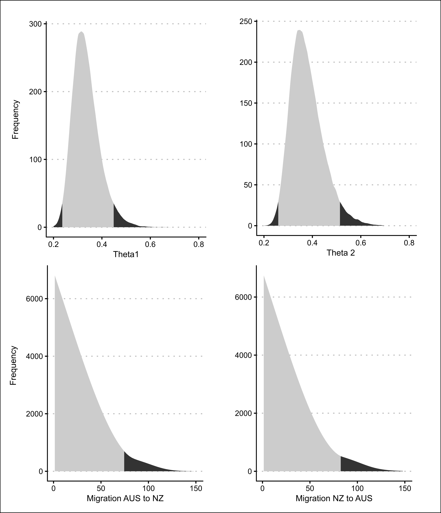

# (APPENDIX) Appendix {-}

# {#appendix}

### High salt DNA extraction protocol {-}

#### Ingredients: {-}

-	20mg/ml proteinase K
-	DNA extraction buffer (0.4M NaCl, 10mM Tris-HCl pH 8.0, and 2mM EDTA pH 8.0)
-	TE buffer (10 mM Tris, 1mM EDTA, pH 8.0)
-	20% sodium dodecyl sulfate (warm to re-dissolve)
-	5M sodium chloride (NaCl saturated dH~2~O: Autoclave)
-	100% isopropanol
-	70% ethanol

#### Sample preparation {-}

1. Select the samples to be used from the freezer and hold on ice during sample prep.
2. Remove the tissue and cut a portion onto a clean kimwipe in a petri dish.
3. Squash out the ethanol or scrape excess salts, weigh ~20-40mg of tissue into a 1.5ml microcentrifuge tube and return tissue to storage. Cut up the tissue. to improve digestion and prevent the tissue from sticking to side of tube. 
4. Clean forceps and scissors between each sub-sample by wiping with a clean paper kimwipe, dipping in 98% ethanol and sterilising by passing through a flame

#### Cell lysis {-}

1. Add 400$\mu$l of DNA extraction buffer and 80$\mu$l of SDS (If SDS has precipitated, dissolve it on a heatblock (>40$^\circ$C).
2. Add 10$\mu$l of proteinase K.
3. Place in orbital mixer for 2hrs to overnight set to 300rpm and 50$^\circ$C throughout digestion.

#### Protein precipitation and removal {-}

1. Centrifuge max speed – 5 min.
2. Transfer supernatant to a new tube. 
3. Add 320$\mu$l of 5M sodium chloride to each tube and mix by inverting the tubes 60 times.
4. Centrifuge max speed – 10 min.
5. Transfer supernatant to a new tube. 

#### DNA precipitation {-}

1. Add 525$\mu$l of chilled (-20$^\circ$C) 100% isopropanol to the supernatant.
2. Inverted 60 times.
3. Centrifuge tubes for 20 min at 13K rpm (15.7k xg) at 4$^\circ$C. 
4. Carefully remove supernatant without disturbing pellet. 
5. Add 1ml of chilled 70% ethanol to tubes and invert 60 times. 
6. Centrifuge for 10 min at 13K rpm (15.7k xg) at 4$^\circ$C.  
7. Remove the supernatant and air dry the pellet for approximately 5 min at 37$^\circ$C on heat block, leave tubes open and cover with kimwipe - do not over-dry. 

#### DNA rehydration {-}

1. Add 30$\mu$l of TE buffer to the dried pellet (dilute further if needed) and gently agitate tube to resuspended DNA. Leave to rehydrate for ~2hrs to overnight.
2. Store DNA in fridge until checking quality (no longer than 48 hrs) or store in freezer for long term storage.

#### DNA Quantification {-}

1. Quantify DNA on the Nanodrop. Record ng/$\mu$l, 260/280 ratio (>1.8 pure DNA and <1.7 indicates protein contamination) and 260/230 ratio (<1.5 indicate salt contamination, ideally >1.8). 
2. Wipe pedestal clean with water.
3. Add 1$\mu$l of TE buffer and run blank.
4. Wipe pedestal with kimwipe then add 1$\mu$l of the first sample and click analyse.
5. Repeat this step for each sample, wiping the pedestal clean with a kimwipe between samples, re-blank with TE buffer after every 5 samples.
6. If DNA is too concentrated, dilute then store samples in fridge for at least 2 hours before re-measuring. Gently agitate tube to resuspend DNA before re-measuring. Aiming for around 100-200ng/$\mu$l of DNA.
7. Analyse 1$\mu$l of DNA on a 1% agrose gel. Compare against 1$\mu$l of a high molecular weight ladder such as lambda Hind 11. Run gel for 30 minutes at 90V.
8. Stain gel in Ethidium bromide for 20mins, wash in H~2~0 for 1min and visualize in the UV imaging box.

```{r mtGenomeSequence, out.width = "140%", fig.pos = "H", out.extra = "angle = 270", fig.align = "center", fig.cap = "Final *P. georgianus* mitochondrial genome sequence."}
knitr::include_graphics("imagesFinal/10-appendix/mtGenomeSequence.png")
```

```{r alignmentCoi1, out.width = "140%", fig.pos = "H", out.extra = "angle = 270", fig.align = "center", fig.cap = "Final COI alignment."}

```

```{r alignmentCoi2, out.width = "140%", fig.pos = "H", out.extra = "angle = 270", fig.align = "center", fig.cap = "Figure continued."}

```

```{r alignmentCoi3, out.width = "140%", fig.pos = "H", out.extra = "angle = 270", fig.align = "center", fig.cap = "Figure continued."}

```

```{r alignmentControl1, out.width = "140%", fig.pos = "H", out.extra = "angle = 270", fig.align = "center", fig.cap = "Final control region alignment (83 of 304 sequences)."}

```

```{r alignmentControl2, out.width = "140%", fig.pos = "H", out.extra = "angle = 270", fig.align = "center", fig.cap = "Figure continued."}

```

```{r alignmentControl3, out.width = "140%", fig.pos = "H", out.extra = "angle = 270", fig.align = "center", fig.cap = "Figure continued."}

```

```{r alignmentIslands, out.width = "140%", fig.pos = "H", out.extra = "angle = 270", fig.align = "center", fig.cap = "Final control region alignment of five Trevally sampled from Three Kings and Kermadec Islands."}
knitr::include_graphics("imagesFinal/10-appendix/alignmentIslands.png")
```

```{r eval = FALSE}
theta1 <- read.csv("data/10-appendix/theta1PosteriorDistribution.csv", stringsAsFactors = FALSE, header = TRUE)
theta2 <- read.csv("data/10-appendix/theta2PosteriorDistribution.csv", stringsAsFactors = FALSE, header = TRUE)
migration1 <- read.csv("data/10-appendix/migration1PosteriorDistribution.csv", stringsAsFactors = FALSE, header = TRUE)
migration2 <- read.csv("data/10-appendix/migration2PosteriorDistribution.csv", stringsAsFactors = FALSE, header = TRUE)
theta1$HPC95 <- as.factor(theta1$HPC95)
theta2$HPC95 <- as.factor(theta2$HPC95)
migration1$HPC95 <- as.factor(migration1$HPC95)
migration2$HPC95 <- as.factor(migration2$HPC95)

posterior1 <- ggplot(theta1, aes(x = parameter.value, y = count)) +
   geom_area(aes(fill = HPC95)) +
   scale_fill_grey() +
   theme_clean(base_size = 13, ) +
   scale_x_continuous(limits = c(0.2, 0.8), breaks = scales::pretty_breaks(n = 4)) + 
   labs(x = "Theta1", y = "Frequency")

posterior2 <- ggplot(theta2, aes(x = parameter.value, y = count)) +
   geom_area(aes(fill = HPC95)) +
   scale_fill_grey() +
   theme_clean(base_size = 13) +
   scale_x_continuous(limits = c(0.2, 0.8), breaks = scales::pretty_breaks(n = 4)) +
   labs(x = "Theta 2", y = "Frequency")

migration1 <- ggplot(migration1, aes(x = parameter.value, y = count)) +
   geom_area(aes(fill = HPC95)) +
   scale_fill_grey() +
   theme_clean(base_size = 13) +
   scale_x_continuous(limits = c(1, 150), breaks = scales::pretty_breaks(n = 4)) + 
   labs(x = "Migration AUS to NZ", y = "Frequency")

migration2 <- ggplot(migration2, aes(x = parameter.value, y = count)) +
   geom_area(aes(fill = HPC95)) +
   scale_fill_grey() +
   theme_clean(base_size = 13) +
   scale_x_continuous(limits = c(1, 150), breaks = scales::pretty_breaks(n = 4)) + 
   labs(x = "Migration NZ to AUS", y = "Frequency")

arrangeGrob(posterior1, posterior2, migration1, migration2, nrow = 2, ncol = 2) %>%
  ggsave(file = "images/10-appendix/posteriorProbabilities.svg", width = 9, height = 9, device = "svg", units = "in")
```

```{r posteriorDistribution, out.width = "100%", fig.pos = "H", fig.align = "center", fig.cap = "Posterior probability distributions for all four Migrate model parameters."}

```